# Class Activity 1 — System Calls in Practice

- **Student Name:** Ouk Puthirith
- **Student ID:** p20240033
- **Date:** 30/03/2026

---

## Warm-Up: Hello System Call

Screenshot of running `hello_syscall.c` on Linux:

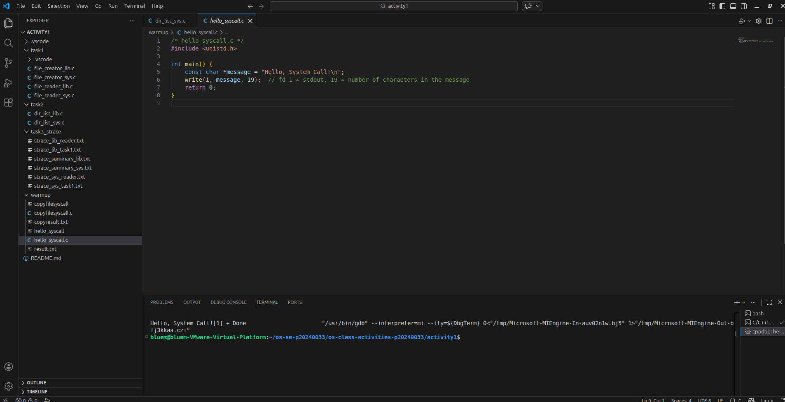

Screenshot of running `hello_winapi.c` on Windows (CMD/PowerShell/VS Code):

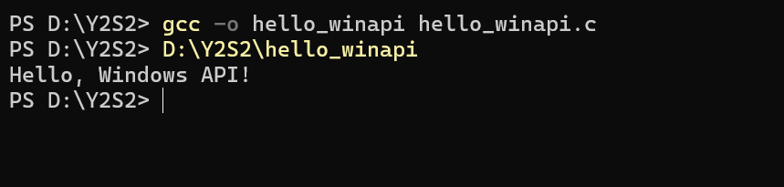

Screenshot of running `copyfilesyscall.c` on Linux:

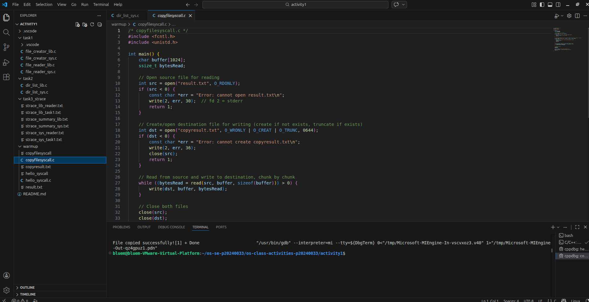

---

## Task 1: File Creator & Reader

### Part A — File Creator

**Describe your implementation:**
The library version (`fopen`/`fprintf`/`fclose`) abstracts away the low-level details — it handles buffering, flag translation, and error state automatically. The system call version requires manually specifying flags to `open()`, choosing a permission mode, writing raw bytes with `write()`, and closing the descriptor with `close()`. The system call version is more explicit and lower-level, making it easier to see exactly what the OS does.

**Version A — Library Functions (`file_creator_lib.c`):**

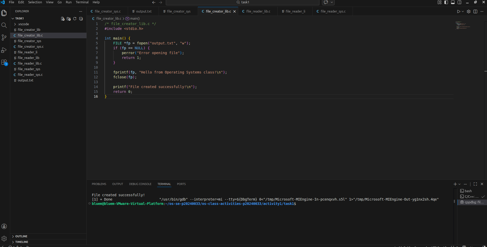

**Version B — POSIX System Calls (`file_creator_sys.c`):**

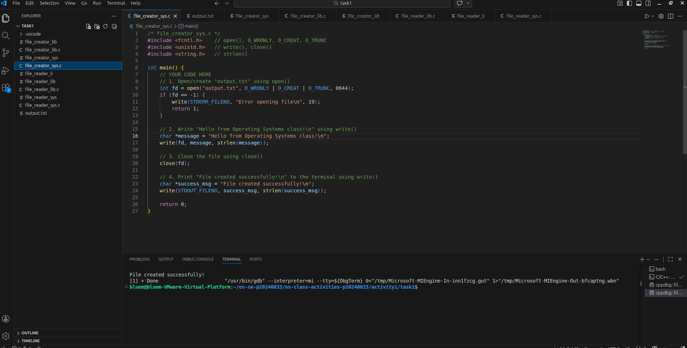

**Questions:**

1. **What flags did you pass to `open()`? What does each flag mean?**

   The flags passed were `O_WRONLY | O_CREAT | O_TRUNC`:
   - `O_WRONLY` — Open the file for writing only.
   - `O_CREAT` — Create the file if it does not already exist.
   - `O_TRUNC` — If the file already exists, truncate (clear) its contents to zero length before writing.

   Together, these replicate the behavior of `fopen(..., "w")`.

2. **What is `0644`? What does each digit represent?**

   `0644` is an octal file permission mode:
   - The leading `0` indicates this is an octal literal.
   - `6` (owner) = read + write (4 + 2 = 6).
   - `4` (group) = read only.
   - `4` (others) = read only.

   So the file owner can read and write the file, while everyone else can only read it.

3. **What does `fopen("output.txt", "w")` do internally that you had to do manually?**

   `fopen()` internally calls `open()` with the appropriate flags (`O_WRONLY | O_CREAT | O_TRUNC`), allocates a `FILE` struct in user space, sets up an I/O buffer for buffered writing, and manages error state via `errno`. When using `open()` directly, you must specify all flags yourself, manage the integer file descriptor by hand, handle all writing as raw bytes via `write()`, and there is no buffering layer unless you add one yourself.

---

### Part B — File Reader & Display

**Describe your implementation:**
The library version uses `fopen`/`fgets`/`fclose`, which buffer input and return null-terminated strings. The system call version uses `open`/`read`/`close`, which operate on raw bytes and require a loop to handle partial reads. The system call version requires more care: the buffer is not automatically null-terminated and `read()` may return fewer bytes than requested.

**Version A — Library Functions (`file_reader_lib.c`):**

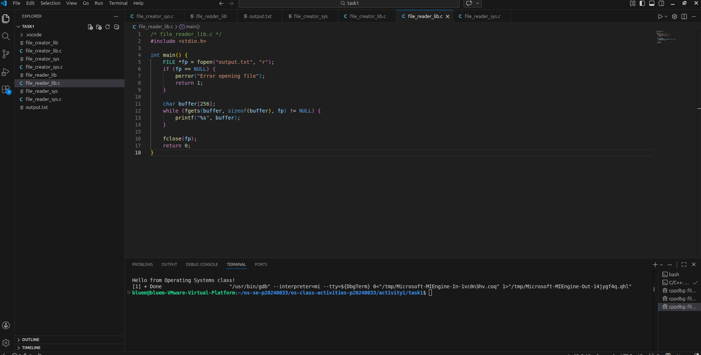

**Version B — POSIX System Calls (`file_reader_sys.c`):**

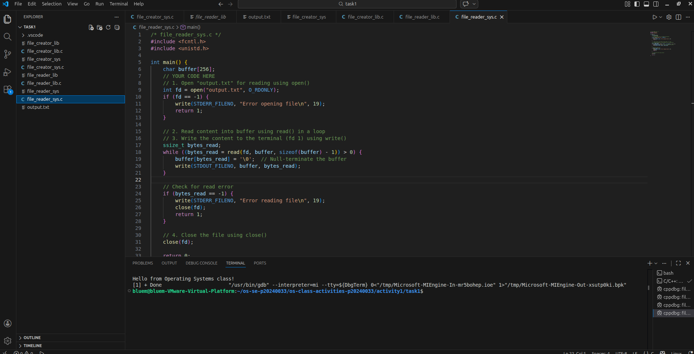

**Questions:**

1. **What does `read()` return? How is this different from `fgets()`?**

   `read()` returns a `ssize_t` — the number of bytes actually read from the file descriptor. It returns `0` at end-of-file and `-1` on error. Unlike `fgets()`, it does not append a null terminator, does not stop at newline characters, and performs no internal buffering. It reads raw bytes directly from the kernel with no formatting or interpretation.

2. **Why do you need a loop when using `read()`? When does it stop?**

   `read()` is not guaranteed to return all requested bytes in a single call. It may return fewer bytes than requested (a "short read"), especially when reading from pipes, sockets, or large files. A loop is required to keep calling `read()` until it returns `0` (end-of-file) or `-1` (error). Each iteration processes however many bytes were returned and advances the buffer pointer accordingly.

---

## Task 2: Directory Listing & File Info

**Describe your implementation:**
The library version uses `opendir`/`readdir`/`closedir` to iterate over directory entries, providing a clean abstraction. The system call version uses lower-level calls and requires manual formatting of output. Both versions call `stat()` to retrieve file metadata. The key difference is how directory entries are obtained and how results are formatted for output.

### Version A — Library Functions (`dir_list_lib.c`)

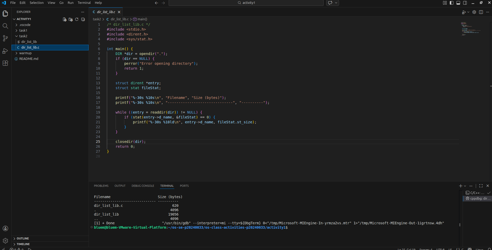

### Version B — System Calls (`dir_list_sys.c`)

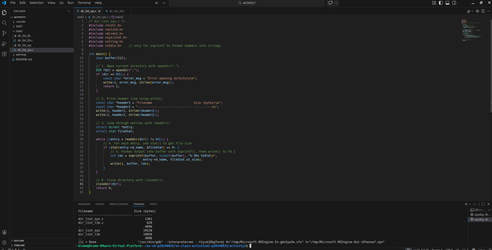

### Questions

1. **What struct does `readdir()` return? What fields does it contain?**

   `readdir()` returns a pointer to a `struct dirent`, which contains:
   - `d_ino` — The inode number of the file.
   - `d_off` — Offset to the next directory entry.
   - `d_reclen` — Length of this record in bytes.
   - `d_type` — The type of file (e.g., `DT_REG` for regular file, `DT_DIR` for directory, `DT_LNK` for symbolic link).
   - `d_name` — The null-terminated filename string.

2. **What information does `stat()` provide beyond file size?**

   `stat()` fills a `struct stat` with a wide range of metadata:
   - `st_mode` — File type and permission bits (e.g., readable, writable, executable).
   - `st_uid` / `st_gid` — Owner user ID and group ID.
   - `st_ino` — Inode number.
   - `st_nlink` — Number of hard links to the file.
   - `st_atime` — Last access time.
   - `st_mtime` — Last modification time.
   - `st_ctime` — Last status change time.
   - `st_blksize` / `st_blocks` — Preferred I/O block size and number of 512-byte blocks allocated.

3. **Why can't you `write()` a number directly — why do you need `snprintf()` first?**

   `write()` operates on raw bytes and has no concept of data types or text formatting. An integer like `42` stored in memory is simply binary data (e.g., `0x0000002A`), not the ASCII characters `'4'` and `'2'`. `snprintf()` converts the integer into its human-readable decimal string representation first, so that when `write()` sends those bytes to the terminal or file, they appear as readable text rather than garbled binary data.

---

## Optional Bonus: Windows API (`file_creator_win.c`)

Screenshot of running on Windows:

### Bonus Questions

1. **Why does Windows use `HANDLE` instead of integer file descriptors?**

   `HANDLE` is an opaque pointer to a kernel object managed by the Windows Object Manager. This design allows the same handle type to uniformly represent files, threads, processes, events, mutexes, and more — providing a unified resource management model. POSIX file descriptors are simple small integers indexing a per-process file descriptor table, which is simpler but only covers file-like objects. The `HANDLE` abstraction is more general but also more complex.

2. **What is the Windows equivalent of POSIX `fork()`? Why is it different?**

   The Windows equivalent is `CreateProcess()`. Unlike `fork()`, which clones the entire calling process into a nearly identical child (using copy-on-write semantics), `CreateProcess()` always launches a brand-new, separate executable from disk. There is no concept of a child process inheriting the parent's exact memory image. This makes Windows process creation heavier and more explicit. The reason for the difference is design philosophy: Windows was designed for explicit process launching from the start, while Unix's `fork()` + `exec()` model was designed for flexible process spawning and shell pipelines.

3. **Can you use POSIX calls on Windows?**

   Not natively. However, several compatibility options exist:
   - **WSL (Windows Subsystem for Linux)** provides a full Linux environment within Windows.
   - **Cygwin** and **MSYS2** provide POSIX emulation through a compatibility DLL (`cygwin1.dll`).
   - The **Microsoft C Runtime** exposes some POSIX-like functions (`_open`, `_read`, `_write`, etc.) with limitations and different semantics.

   Native Windows development uses the Win32 API (`CreateFile`, `ReadFile`, `WriteFile`, etc.) rather than POSIX calls.

---

## Task 3: strace Analysis

**Describe what you observed:**
The most surprising finding was the sheer number of extra system calls the library version generates before any actual file I/O occurs. The dynamic linker alone triggers dozens of `openat`, `mmap`, `mprotect`, and `fstat` calls just to load shared libraries. The direct system call version was lean by comparison — only the system calls explicitly written in the code appeared in the trace. The `strace -c` summary made the difference starkly clear.

### strace Output — Library Version (File Creator)

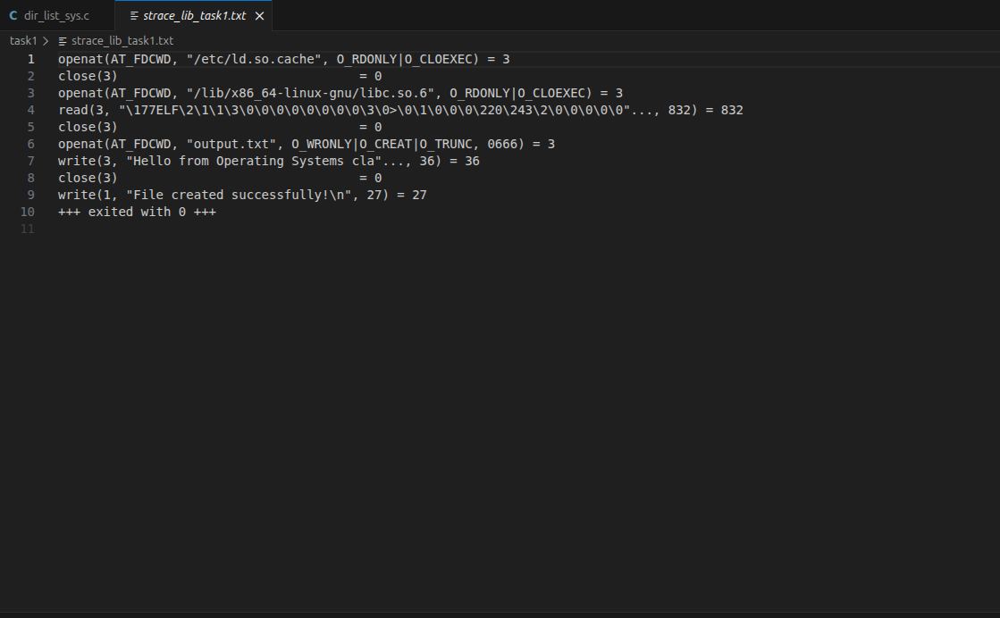

### strace Output — System Call Version (File Creator)

### strace Output — Library Version (File Reader or Dir Listing)

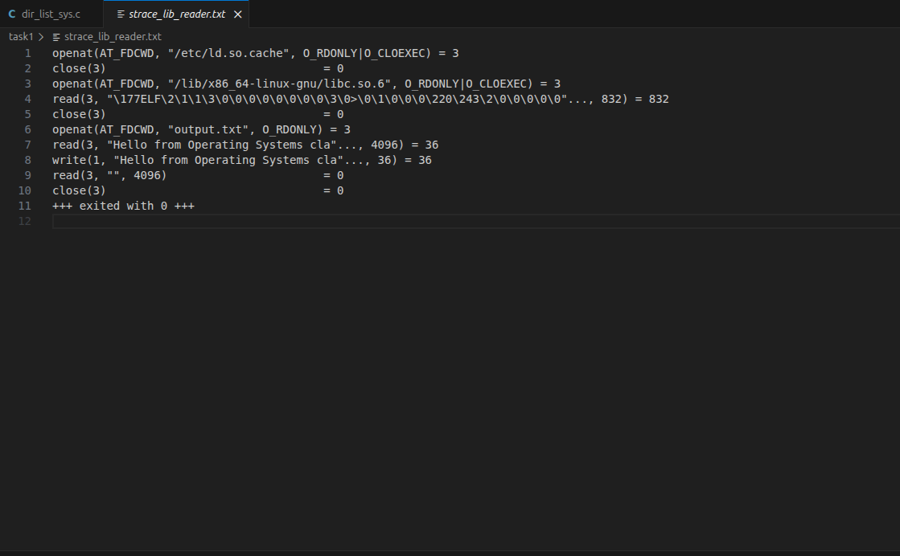

### strace Output — System Call Version (File Reader or Dir Listing)

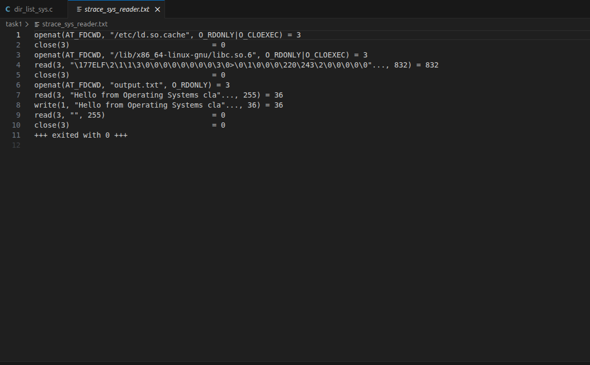

### strace -c Summary Comparison

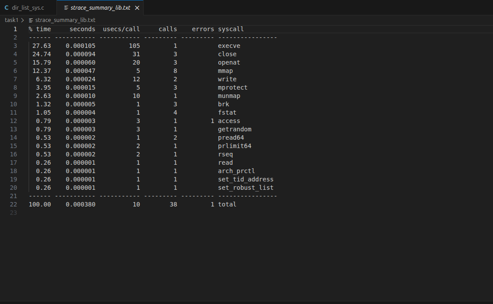
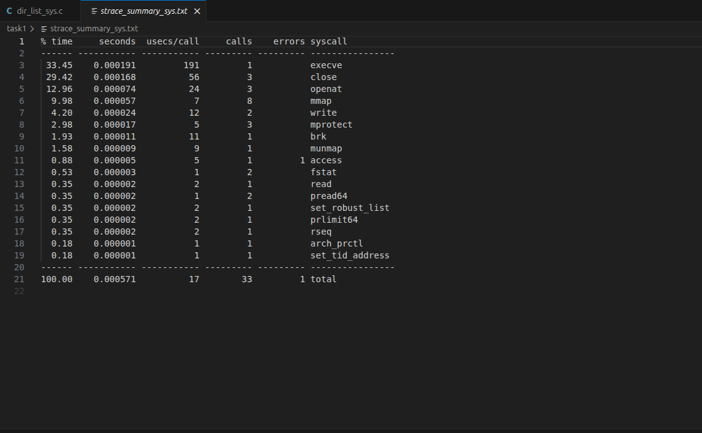

### Questions

1. **How many system calls does the library version make compared to the system call version?**

   Based on `strace -c` output, the library version typically makes **50–100+ system calls**, while the direct system call version makes as few as **5–10**. The library version's overhead comes primarily from C runtime startup, dynamic linking of shared libraries, and internal buffer management in `libc`. The exact counts depend on your specific implementation and are visible in the `strace -c` totals column.

2. **What extra system calls appear in the library version? What do they do?**

   - `brk` — Adjusts the program's heap boundary to allocate memory for internal buffers and data structures used by `libc`.
   - `mmap` — Maps memory regions; used by the dynamic linker to load shared libraries (e.g., `libc.so`) into process address space.
   - `fstat` — Checks file metadata; called internally by `fopen()` to determine the file type and configure appropriate buffering.
   - `mprotect` — Sets memory protection flags on mapped regions; used by the loader to enforce read/execute permissions on code pages.
   - `openat` — Opens shared library files (e.g., `libc.so.6`, `ld-linux.so`) during dynamic linking at program startup.
   - `pread64` — Used internally by the dynamic linker to read ELF headers and segment data from library files.

3. **How many `write()` calls does `fprintf()` actually produce?**

   Usually just **one** `write()` system call per buffer flush, even if `fprintf()` is called multiple times. The C standard library buffers output in user space and batches all pending data into a single `write()` call when the buffer is full, when `fflush()` is called, or when the file is closed. This demonstrates the key performance benefit of buffered I/O: reducing the number of expensive kernel transitions.

4. **In your own words, what is the real difference between a library function and a system call?**

   A library function (like `fopen`, `printf`, `malloc`) is just compiled C code that runs entirely in **user space** — it lives in your process's memory and executes on the CPU without any special privileges. A system call is a **controlled entry point into the OS kernel**: when invoked, the CPU switches from unprivileged user mode to privileged kernel mode, the OS executes the requested operation on behalf of the process (such as reading from disk or allocating memory), and then control returns to user space. Library functions often wrap system calls but add value through buffering, formatting, error handling, and portability. System calls represent the actual boundary between a program and the operating system's control over hardware.

---

## Task 4: Exploring OS Structure

### System Information

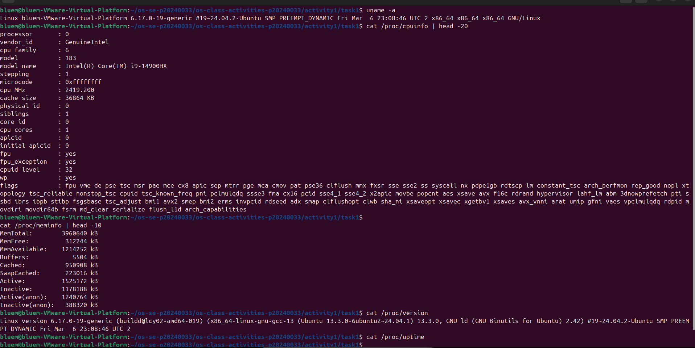

### Process Information

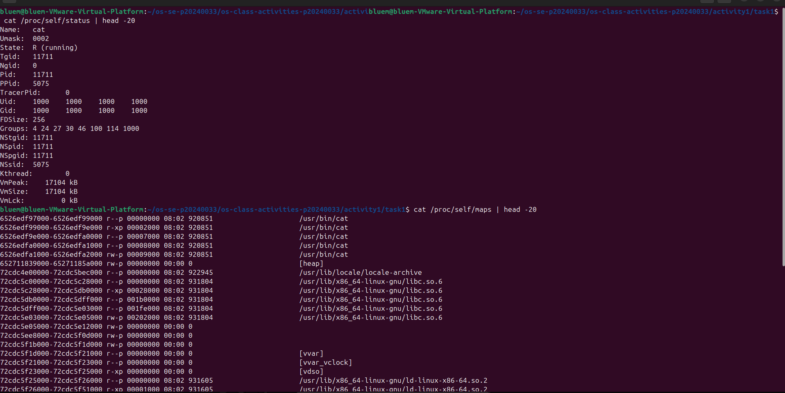

### Kernel Modules

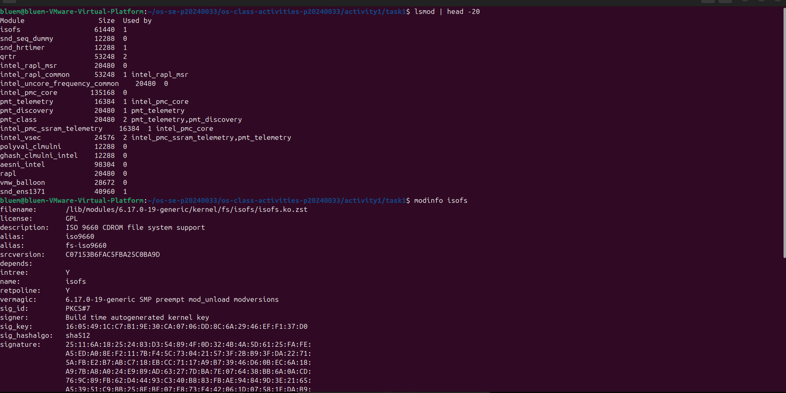

### OS Layers Diagram

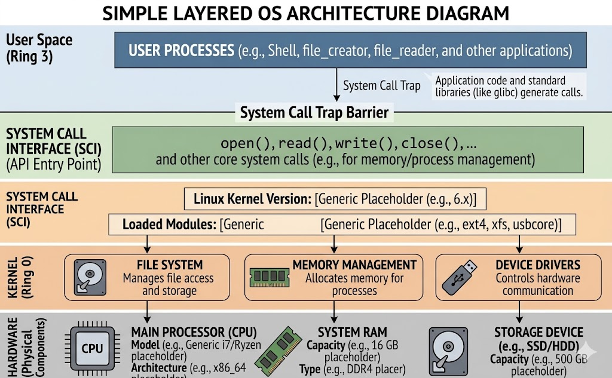

### Questions

1. **What is `/proc`? Is it a real filesystem on disk?**

   `/proc` is a **virtual filesystem** (also called a pseudo-filesystem). It does not exist on disk at all — it is generated dynamically by the Linux kernel entirely in memory. When you read a file like `/proc/cpuinfo`, the kernel constructs the content on the fly by reading from internal data structures. `/proc` is mounted at boot time as a special filesystem type (`proc`). It provides a simple, file-based interface for user-space programs to inspect and sometimes modify kernel state, running processes, hardware information, and system configuration — all without needing special tools or privileges beyond basic file read access.

2. **Monolithic kernel vs. microkernel — which type does Linux use?**

   Linux uses a **monolithic kernel**. In a monolithic design, all core OS services — including device drivers, filesystem management, network stack, memory management, and process scheduling — run together in the same kernel address space with full hardware privileges. This contrasts with a **microkernel** (like Mach or seL4), where most services run as isolated user-space processes and communicate via inter-process communication (IPC). Linux is monolithic but **modular**: kernel modules (`.ko` files) can be dynamically loaded and unloaded at runtime without rebooting, giving some flexibility without the overhead of a true microkernel.

3. **What memory regions do you see in `/proc/self/maps`?**

   Typical regions visible in `/proc/self/maps` include:
   - **Executable segments** — `.text` (code), `.rodata` (read-only data), `.data` / `.bss` (initialized and uninitialized global variables) from the program binary.
   - **Shared library mappings** — memory-mapped regions for `libc.so`, `ld-linux.so`, and any other linked shared libraries.
   - **Heap** — an anonymous read/write region that grows upward, used by `malloc` / `free`.
   - **Stack** — a read/write region that grows downward, used for function call frames and local variables.
   - **vdso** — a kernel-provided virtual dynamic shared object that maps certain system call implementations (like `gettimeofday`) into user space for faster execution without a full context switch.
   - **vvar** — a read-only kernel data page for variables shared between kernel and user space (used by vdso).
   - **Anonymous mmap regions** — additional memory mapped by the C runtime or libraries for internal use.

4. **Break down the kernel version string from `uname -a`.**

   A typical string such as `Linux hostname 6.5.0-44-generic #44~22.04.1-Ubuntu SMP PREEMPT_DYNAMIC x86_64` breaks down as:
   - `Linux` — The operating system name.
   - `hostname` — The machine's hostname.
   - `6` — Major kernel version.
   - `5` — Minor kernel version (odd = development, even = stable in older conventions).
   - `0` — Patch/revision level.
   - `44-generic` — Distribution-specific ABI version and kernel flavour (`generic` = standard desktop/server build).
   - `#44~22.04.1-Ubuntu` — The build number and distribution tag.
   - `SMP` — Symmetric Multi-Processing support is compiled in (supports multiple CPU cores).
   - `PREEMPT_DYNAMIC` — The kernel supports configurable preemption at runtime.
   - `x86_64` — The CPU architecture (64-bit Intel/AMD).

5. **How does `/proc` show that the OS is an intermediary between programs and hardware?**

   `/proc` perfectly illustrates the OS's role as an intermediary because it exposes hardware information — CPU type, memory size, device I/O stats — through simple files, yet no user program accesses hardware directly. When a program reads `/proc/cpuinfo`, it issues a `read()` system call; the kernel then mediates that request by reading from internal hardware-facing data structures and presenting the result as text. The hardware itself is never touched directly by the user program. Similarly, `/proc/meminfo` reflects physical RAM state, and `/proc/self/maps` reflects the MMU's page table mappings — all hardware-level concepts surfaced safely through the OS abstraction layer. This chain — user program → system call → kernel → hardware — is exactly what `/proc` makes visible.

---

## Reflection

This activity revealed how much invisible work the C standard library performs on behalf of programmers. Before writing a single byte of application data, the library version of even a simple program triggers dozens of system calls for dynamic linking, heap initialization, and buffer allocation. The most surprising discovery was seeing this through `strace`: a single `printf()` or `fopen()` is backed by a cascade of kernel interactions that are completely hidden from the programmer.

Direct system calls feel lower-level and more demanding — there is no buffering, no automatic null termination, no formatted output, and no error state management. But working with them makes the OS boundary unmistakably clear: every interaction with a file, directory, or device ultimately crosses into the kernel through a controlled interface. Understanding this boundary clarifies why kernel bugs are so serious (they compromise the entire system), why buffered I/O is faster (fewer mode switches), and why the OS is described as an intermediary — it is the only entity permitted to access hardware, and all user programs must ask it for help through system calls.