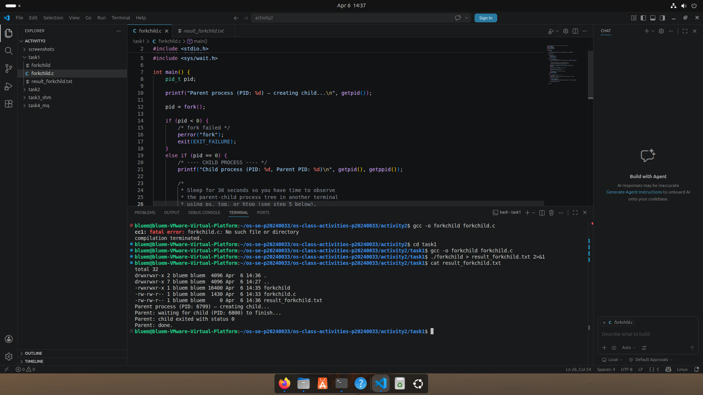
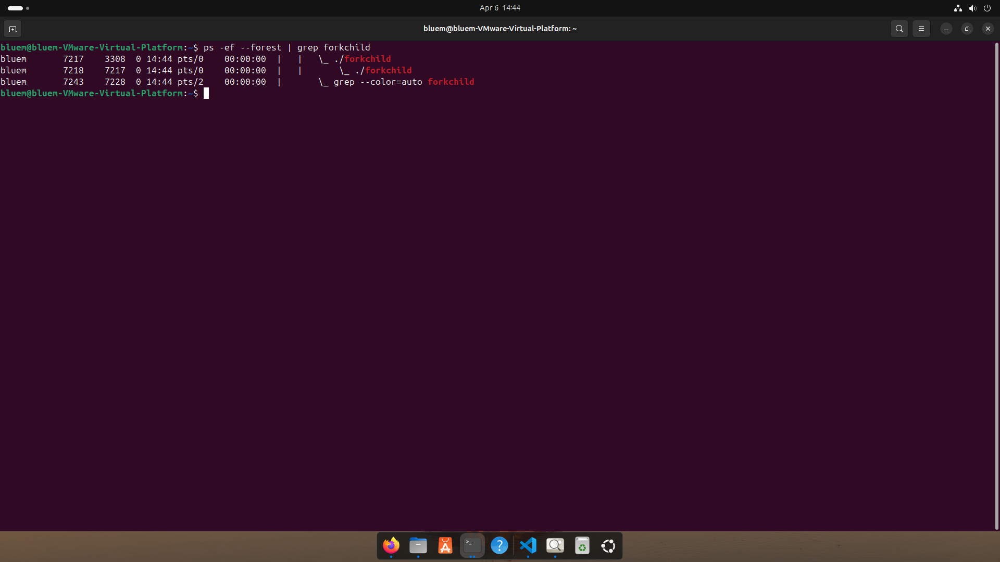
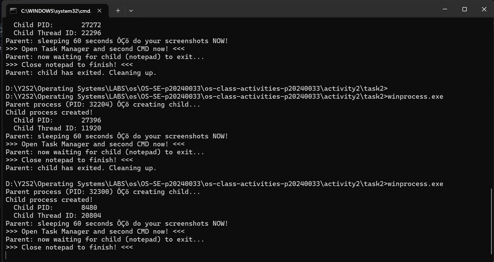
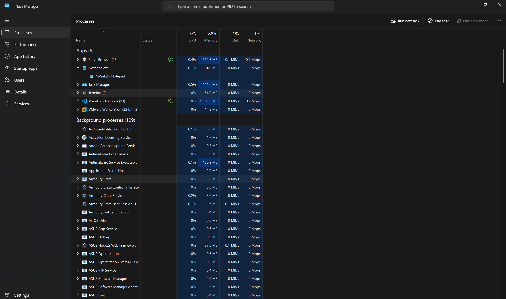
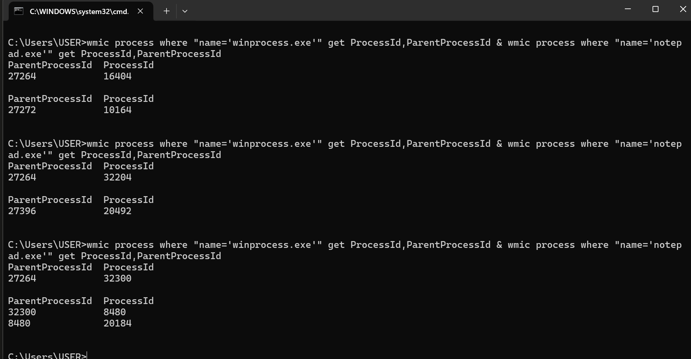
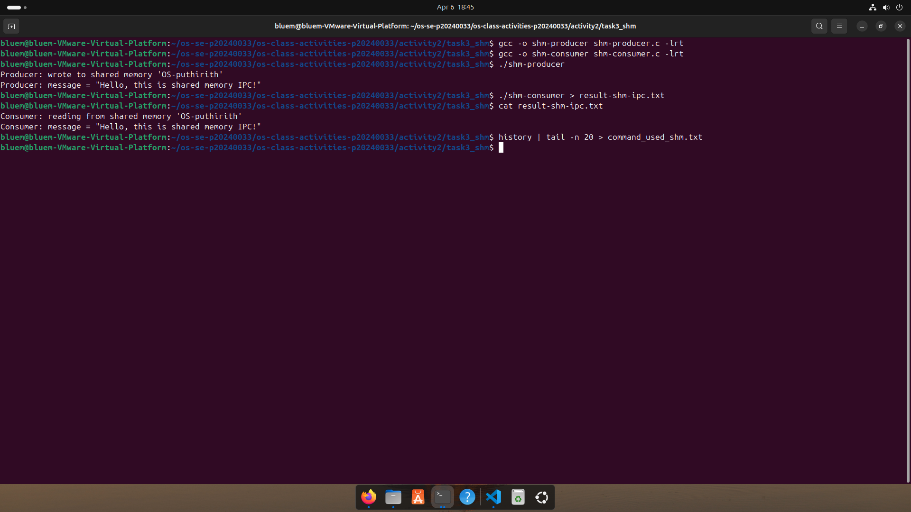
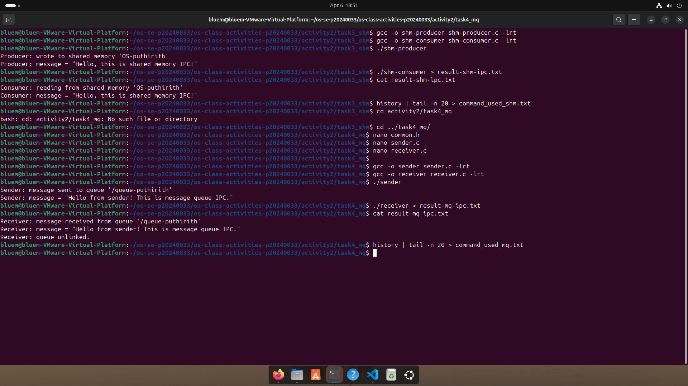

# Class Activity 2 — Processes & Inter-Process Communication

- **Student Name:** Ouk Puthirith
- **Student ID:** p20240033
- **Date:** April 06, 2026

---

## Task 1: Process Creation on Linux (fork + exec)

### Compilation & Execution

Screenshot of compiling and running `forkchild.c`:



### Process Tree

Screenshot of the parent-child process tree (using `ps --forest`, `pstree`, or `htop` tree view):



### Output

```
total 32
drwxrwxr-x 2 bluem bluem  4096 Apr  6 14:36 .
drwxrwxr-x 7 bluem bluem  4096 Apr  6 14:27 ..
-rwxrwxr-x 1 bluem bluem 16400 Apr  6 14:35 forkchild
-rw-rw-r-- 1 bluem bluem  1430 Apr  6 14:33 forkchild.c
-rw-rw-r-- 1 bluem bluem     0 Apr  6 14:44 result_forkchild.txt
Parent process (PID: 7217) — creating child...
Parent: waiting for child (PID: 7218) to finish...
Parent: child exited with status 0
Parent: done.

```

### Questions

1. **What does `fork()` return to the parent? What does it return to the child?**

   > `fork()` returns the child's PID (a positive integer) to the parent process, so the parent knows which process it created. It returns 0 to the child process, so the child knows it is the newly created process. If `fork()` fails, it returns -1 to the parent and no child is created.

2. **What happens if you remove the `waitpid()` call? Why might the output look different?**

   > If `waitpid()` is removed, the parent process will not wait for the child to finish. The parent may exit before the child completes, causing the child to become a "zombie" process (a process that has finished but has not been cleaned up). The output may look different because the parent's "done" message could appear before the child's output, making the order unpredictable.

3. **What does `execlp()` do? Why don't we see "execlp failed" when it succeeds?**

   > `execlp()` replaces the current process image with a new program — in this case `ls -la`. It searches the system PATH for the executable. When `execlp()` succeeds, the current process is completely replaced by the new program, so any code after `execlp()` (including the `perror("execlp")` line) is never reached. We only see "execlp failed" if `execlp()` returns, which only happens on error.

4. **Draw the process tree for your program (parent → child). Include PIDs from your output.**

   > ```
   > Parent Process (PID: 6799)
   >        │
   >        └── fork()
   >               │
   >        Child Process (PID: 6800)
   >               │
   >               └── execlp("ls", "-la")
   >                      │
   >                 ls -la runs and exits
   >               │
   >        Parent waits via waitpid()
   >               │
   >        Parent: done.
   > ```

5. **Which command did you use to view the process tree (`ps --forest`, `pstree`, or `htop`)? What information does each column show?**

   > I used `ps -ef --forest | grep forkchild`. The columns show:
   > - **UID** — the username of the process owner
   > - **PID** — the Process ID of the process
   > - **PPID** — the Parent Process ID (shows which process created this one)
   > - **C** — CPU utilization
   > - **STIME** — the time the process started
   > - **TTY** — the terminal associated with the process
   > - **TIME** — total CPU time used
   > - **CMD** — the command name, with `\_` showing child processes indented under their parent

---

## Task 2: Process Creation on Windows

### Compilation & Execution

Screenshot of compiling and running `winprocess.c`:



### Task Manager Screenshots

Screenshot showing process tree in the **Processes** tab:



Screenshot showing PID and Parent PID relationship verified via wmic:



### Note on mspaint.exe

> On this system (Windows 11), `mspaint.exe` is installed as a **Windows Store application**
> (Microsoft.Paint version 11.2601.401.0, SignatureKind: Store). Windows Store apps use a
> special activation mechanism and **cannot be launched directly via `CreateProcess()`** —
> attempting to do so results in `CreateProcess failed (error 2)` (file not found), even though
> the alias exists at `C:\Users\USER\AppData\Local\Microsoft\WindowsApps\mspaint.exe`.
>
> `notepad.exe` was used instead as it is a classic Win32 application located at
> `C:\Windows\System32\notepad.exe` and fully supports `CreateProcess()`.
> The concept demonstrated is identical — `CreateProcess()` launches notepad.exe as a
> child process, the parent waits using `WaitForSingleObject()`, and the parent-child
> relationship is verified using the `wmic` command showing matching PIDs.

### Questions

1. **What is the key difference between how Linux creates a process (`fork` + `exec`) and how Windows does it (`CreateProcess`)?**

   > On Linux, process creation is a two-step operation: `fork()` first creates an exact copy of the parent process, then `exec()` replaces the child's memory with a new program. On Windows, `CreateProcess()` does everything in a single step — it creates a new process and immediately loads the specified program into it. There is no equivalent of `fork()` on Windows. Linux's approach gives more flexibility (you can modify the child before exec), while Windows's approach is simpler and more direct.

2. **What does `WaitForSingleObject()` do? What is its Linux equivalent?**

   > `WaitForSingleObject(pi.hProcess, INFINITE)` blocks the parent process until the specified child process (identified by its handle) terminates. `INFINITE` means it will wait forever until the child exits. Its Linux equivalent is `waitpid(pid, &status, 0)`, which also blocks the parent until the child process with the given PID finishes.

3. **Why do we need to call `CloseHandle()` at the end? What happens if we don't?**

   > `CloseHandle()` releases the Windows kernel object handles for the child process and thread. If we don't call it, the handles remain open and the associated kernel resources are not freed, causing a **resource/handle leak**. While the OS will clean up when the program exits, it is good practice to always close handles explicitly to avoid leaks in long-running programs.

4. **In Task Manager, what was the PID of your parent program and the PID of notepad? Do they match your program's output?**

   > Based on the wmic output:
   > - `winprocess.exe` PID: **32300**
   > - `notepad.exe` ParentProcessId: **32300** ✅
   >
   > Yes, notepad's Parent Process ID matches winprocess.exe's Process ID, confirming the parent-child relationship. This matches the PID printed by the program in the terminal output.

5. **Compare the Processes tab (tree view) and the Details tab (PID/PPID columns). Which view makes it easier to understand the parent-child relationship? Why?**

   > On Windows 11, the Details tab (verified via `wmic`) makes it easier to understand the parent-child relationship because it shows the exact PID and ParentProcessId numbers, allowing direct verification that notepad's parent is winprocess.exe. The Processes tab tree view on Windows 11 groups Store apps and modern apps differently and does not always show the correct parent-child nesting for classic Win32 programs launched from a terminal, making it less reliable for this purpose.

---

## Task 3: Shared Memory IPC

### Compilation & Execution

Screenshot of compiling and running `shm-producer` and `shm-consumer`:



### Output

```
Consumer: reading from shared memory 'OS-puthirith'
Consumer: message = "Hello, this is shared memory IPC!"
Consumer: shared memory unlinked.

```

### Questions

1. **What does `shm_open()` do? How is it different from `open()`?**

   > `shm_open()` creates or opens a POSIX shared memory object identified by a name (e.g. `OS-p20240033`). It returns a file descriptor that can be used with `mmap()` to map the memory into a process's address space. The key difference from `open()` is that `shm_open()` creates an object in memory (not on disk) — it is backed by RAM, not a file on the filesystem. `open()` creates or opens actual files on disk, while `shm_open()` creates a memory region that multiple processes can share.

2. **What does `mmap()` do? Why is shared memory faster than other IPC methods?**

   > `mmap()` maps a shared memory object into the process's virtual address space, allowing the process to access it like a regular pointer. Shared memory is the fastest IPC method because data does not need to be copied between processes — both processes access the same physical memory directly. Other IPC methods like message queues or pipes require the kernel to copy data from one process's buffer to another, which adds overhead. With shared memory, once the data is written, it is immediately readable by any other process that has mapped the same region.

3. **Why must the shared memory name match between producer and consumer?**

   > The shared memory name (e.g. `OS-p20240033`) is used by the OS to identify the shared memory object. It works like a key — both processes must use the exact same name to access the same memory region. If the names differ, the consumer will try to open a different (non-existent) shared memory object and will fail with an error.

4. **What does `shm_unlink()` do? What would happen if the consumer didn't call it?**

   > `shm_unlink()` removes the shared memory object from the system. If the consumer doesn't call it, the shared memory object persists in the system even after both programs exit, continuing to consume memory. On Linux, shared memory objects are stored in `/dev/shm/` and will remain there until explicitly unlinked or the system reboots. This is a resource leak.

5. **If the consumer runs before the producer, what happens? Try it and describe the error.**

   > If the consumer runs before the producer, `shm_open()` in the consumer will fail because the shared memory object does not exist yet. The consumer will print:
   > ```
   > shm_open: No such file or directory
   > Hint: Did you run shm-producer first?
   > ```
   > This happens because the consumer opens the shared memory with `O_RDONLY` (no `O_CREAT` flag), so it cannot create the object — it can only open an existing one.

---

## Task 4: Message Queue IPC

### Compilation & Execution

Screenshot of compiling and running `sender` and `receiver`:



### Output

```
Receiver: message received from queue '/queue-puthirith'
Receiver: message = "Hello from sender! This is message queue IPC."
Receiver: queue unlinked.

```

### Questions

1. **How is a message queue different from shared memory? When would you use one over the other?**

   > Shared memory gives processes direct access to a common memory region — it is unstructured and very fast, but requires synchronization (e.g. semaphores) to coordinate access. Message queues send discrete, structured messages one at a time in FIFO order, with the kernel managing storage and delivery. Use shared memory when you need maximum speed and are transferring large amounts of data continuously. Use message queues when you need structured communication, guaranteed message ordering, or when processes run at different speeds and messages need to be queued up.

2. **Why does the queue name in `common.h` need to start with `/`?**

   > POSIX message queue names must start with `/` followed by one or more characters with no additional slashes. This is a POSIX standard requirement — the leading `/` indicates it is a system-wide named object (similar to how shared memory names work). Without the `/`, `mq_open()` will return an error.

3. **What does `mq_unlink()` do? What happens if neither the sender nor receiver calls it?**

   > `mq_unlink()` removes the message queue from the system. If neither the sender nor receiver calls it, the queue persists in the kernel even after both programs exit, continuing to use kernel resources. On Linux, POSIX message queues are visible under `/dev/mqueue/` and will remain there until explicitly unlinked or the system reboots.

4. **What happens if you run the receiver before the sender?**

   > If the receiver runs before the sender, `mq_open()` in the receiver will fail because the queue does not exist yet (the receiver opens with `O_RDONLY`, no `O_CREAT` flag). The receiver will print:
   > ```
   > mq_open: No such file or directory
   > Hint: Did you run sender first?
   > ```

5. **Can multiple senders send to the same queue? Can multiple receivers read from the same queue?**

   > Yes, multiple senders can send to the same queue — their messages will be stored in FIFO order. Multiple receivers can also read from the same queue, but each message is delivered to only one receiver — once a message is received by one process, it is removed from the queue and cannot be read by another. This makes message queues useful for work distribution (task queues) where multiple workers each pick up different tasks.

---

## Reflection

What did you learn from this activity? What was the most interesting difference between Linux and Windows process creation? Which IPC method do you prefer and why?

> In this activity I learned how operating systems create and manage processes on both Linux and Windows, and how processes can communicate with each other using shared memory and message queues. The most interesting difference between Linux and Windows process creation is that Linux uses a two-step approach with `fork()` and `exec()`, where the child starts as an exact copy of the parent before replacing itself with a new program. Windows uses a single `CreateProcess()` call that does everything at once. I found Linux's approach more flexible and easier to understand conceptually. Between the two IPC methods, I prefer shared memory because it is faster and more direct — once the memory is mapped, reading and writing feels just like using a regular variable. However, I can see how message queues are more useful when you need guaranteed ordering and don't want to worry about synchronization.