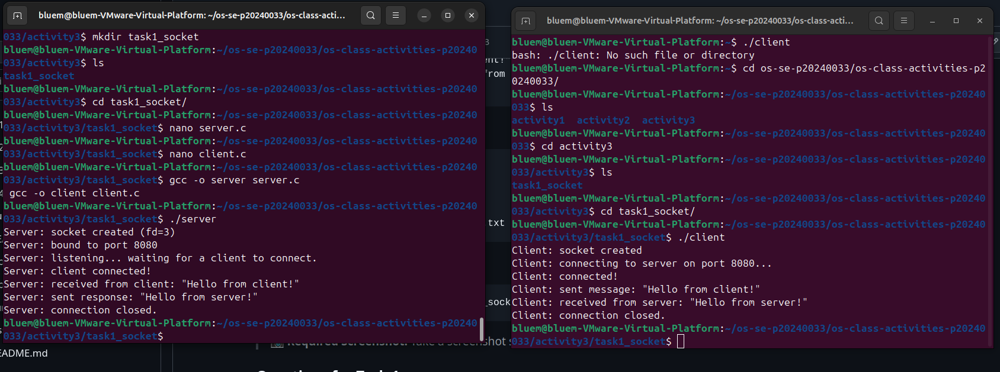
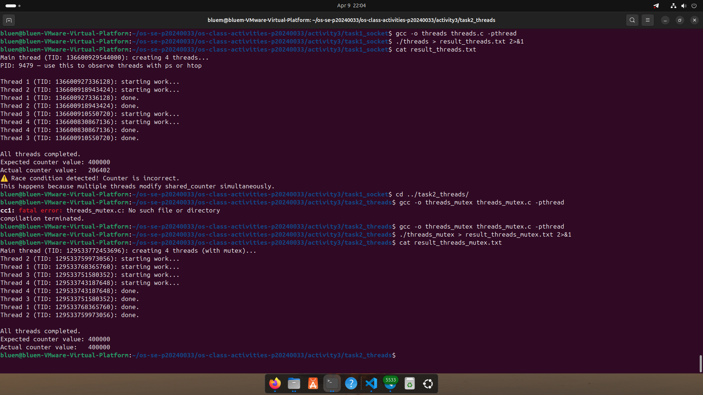
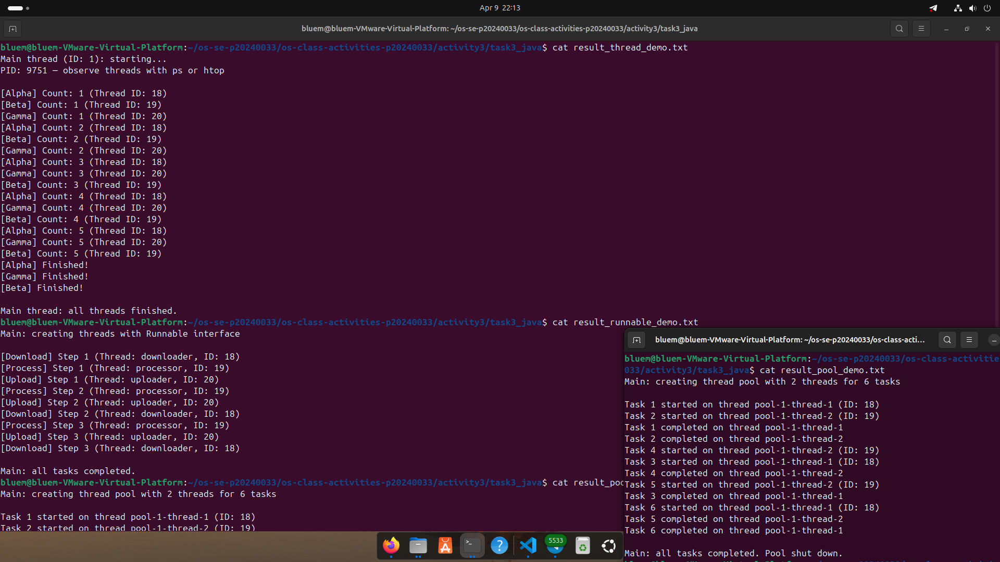
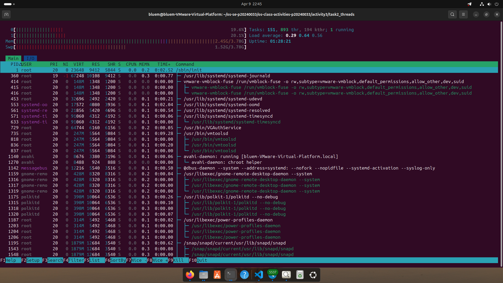
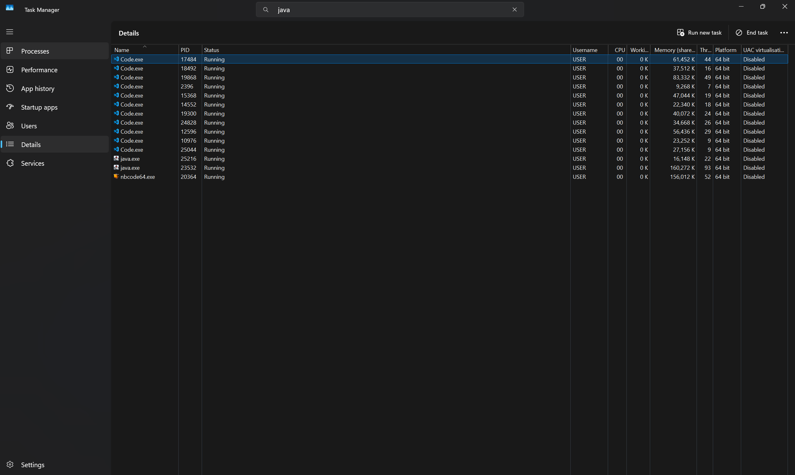

# Class Activity 3 — Socket Communication & Multithreading
- **Student Name:** Ouk Puthirith
- **Student ID:** P20240033
- **Date:** April 9, 2026
---
## Task 1: TCP Socket Communication (C)
### Compilation & Execution

### Answers
1. **Role of `bind()` / Why client doesn't call it:**
   > `bind()` assigns a specific IP address and port number to a socket so clients know where to reach the server. The client does not call `bind()` because the OS automatically assigns it a temporary ephemeral port — the client initiates the connection and does not need a fixed, known address.

2. **What `accept()` returns:**
   > `accept()` blocks until a client connects, then returns a new socket file descriptor dedicated to that client. The original listening socket stays open to accept future connections. All communication with that client happens through the new socket.

3. **Starting client before server:**
   > The connection is immediately refused with a "Connection refused" error. The client's `connect()` call fails because nothing is listening on that port yet. The server must always be started first.

4. **What `htons()` does:**
   > `htons()` stands for Host TO Network Short. It converts a 16-bit port number from the host's byte order (little-endian on most CPUs) to network byte order (big-endian). This ensures machines with different architectures interpret multi-byte values the same way across the network.

5. **Socket call sequence diagram:**
SERVER                          CLIENT
  |                               |
socket()                        socket()
  |                               |
bind()                            |
  |                               |
listen()                          |
  |                               |
accept() <---------------------- connect()
  |        (connection est.)      |
recv()  <----------------------  send()
  |                               |
send()  -----------------------> recv()
  |                               |
close()                        close()
  |                               |
---
## Task 2: POSIX Threads (C)
### Output — Without Mutex (Race Condition)

### Output — With Mutex (Correct)
_(Include in the same screenshot or a separate one)_
### Answers
1. **What is a race condition?**
   > A race condition occurs when two or more threads access shared data concurrently and the final result depends on the unpredictable order of execution. For example, if two threads both read a counter value of 5, both increment it, and both write back 6, the counter should be 7 but ends up as 6. The outcome is non-deterministic and varies between runs.

2. **What does `pthread_mutex_lock()` do?**
   > It locks a mutex (mutual exclusion lock). If the mutex is already held by another thread, the calling thread blocks and waits until it is released. This guarantees only one thread at a time can execute the critical section, preventing race conditions on shared data.

3. **Removing `pthread_join()`:**
   > The main thread will exit before the worker threads finish, causing them to be killed prematurely. The program may terminate with incomplete output or corrupted results because the OS destroys all threads when the main thread exits.

4. **Thread vs Process:**
   > A process is an independent program with its own memory space. A thread is a lighter unit of execution that runs inside a process and shares its memory and resources with other threads. Threads are faster to create and communicate more easily, but require synchronization to avoid race conditions. Processes are more isolated and safer but have higher overhead.

---
## Task 3: Java Multithreading
### ThreadDemo Output

### RunnableDemo Output
_(Include output or screenshot)_
Main: creating threads with Runnable interface

[Download] Step 1 (Thread: downloader, ID: 18)
[Process] Step 1 (Thread: processor, ID: 19)
[Upload] Step 1 (Thread: uploader, ID: 20)
[Process] Step 2 (Thread: processor, ID: 19)
[Upload] Step 2 (Thread: uploader, ID: 20)
[Download] Step 2 (Thread: downloader, ID: 18)
[Process] Step 3 (Thread: processor, ID: 19)
[Upload] Step 3 (Thread: uploader, ID: 20)
[Download] Step 3 (Thread: downloader, ID: 18)
### PoolDemo Output
_(Include output or screenshot)_
Main: creating thread pool with 2 threads for 6 tasks

Task 1 started on thread pool-1-thread-1 (ID: 18)
Task 2 started on thread pool-1-thread-2 (ID: 19)
Task 1 completed on thread pool-1-thread-1
Task 2 completed on thread pool-1-thread-2
Task 4 started on thread pool-1-thread-2 (ID: 19)
Task 3 started on thread pool-1-thread-1 (ID: 18)
Task 4 completed on thread pool-1-thread-2
Task 5 started on thread pool-1-thread-2 (ID: 19)
Task 3 completed on thread pool-1-thread-1
Task 6 started on thread pool-1-thread-1 (ID: 18)
Task 5 completed on thread pool-1-thread-2
Task 6 completed on thread pool-1-thread-1

### Answers
1. **Thread vs Runnable:**
   > Extending `Thread` directly creates a thread subclass, but Java does not support multiple inheritance, so the class cannot extend any other class. Implementing `Runnable` is preferred because it separates the task logic from the thread mechanism, allows the class to extend another class, and works cleanly with thread pools and ExecutorService.

2. **Pool size limiting concurrency:**
   > A thread pool with a fixed size (e.g., 3 threads) means at most 3 tasks run simultaneously regardless of how many are submitted. Additional tasks wait in a queue. This prevents resource exhaustion and keeps CPU and memory usage controlled, which is important in production systems.

3. **`thread.join()` in Java:**
   > `thread.join()` causes the calling thread (usually main) to pause and wait until the specified thread finishes execution. Without it, the main thread may continue or exit before worker threads complete, leading to incomplete results or abrupt termination.

4. **ExecutorService advantages:**
   > ExecutorService manages a pool of reusable threads automatically, avoiding the overhead of creating and destroying threads for every task. It provides a clean API for submitting tasks, retrieving results via Future, handling timeouts, and gracefully shutting down. It is more scalable and easier to manage than manually handling threads.

---
## Task 4: Observing Threads
### Linux — `ps -eLf` Output
_(Paste the relevant ps output here)_
### Linux — htop Thread View

### Windows — Task Manager

### Answers
1. **LWP column meaning:**
   > LWP stands for Light Weight Process. In Linux, each thread is implemented as a lightweight process and given its own LWP ID. The LWP column in `ps -eLf` shows the unique ID of each individual thread within a process, allowing you to distinguish threads that share the same parent PID.

2. **/proc/PID/task/ count:**
   > The `/proc/PID/task/` directory contains one subdirectory per thread in the process. The number of subdirectories equals the number of active threads. You can count them with `ls /proc/PID/task/ | wc -l` to see exactly how many threads a process is running.

3. **Extra Java threads:**
   > Java programs always start several background threads automatically in addition to the main thread. These include the Garbage Collector thread, JIT compiler thread, finalizer thread, and signal dispatcher. This is why a simple Java program shows more threads than expected in ps or htop.

4. **Linux vs Windows thread viewing:**
   > On Linux, threads are viewed using `ps -eLf` (shows LWP per thread), `/proc/PID/task/`, or htop with the H key to show individual threads. On Windows, Task Manager shows thread counts per process under the Details tab. Linux provides more detailed, low-level thread information, while Windows Task Manager gives a simpler high-level view.

---
## Reflection
> What I found most interesting about socket communication is how a simple sequence of system calls (socket, bind, listen, accept, connect) forms the foundation of all networked applications. Threading was equally fascinating because it revealed how concurrency problems like race conditions are subtle and hard to detect without proper synchronization. Understanding threads at the OS level — seeing LWP IDs, observing how the kernel schedules lightweight processes, and watching background JVM threads — makes it much clearer why locks and joins matter. This low-level knowledge helps me write safer concurrent programs by making me think about shared state and timing, not just logic.