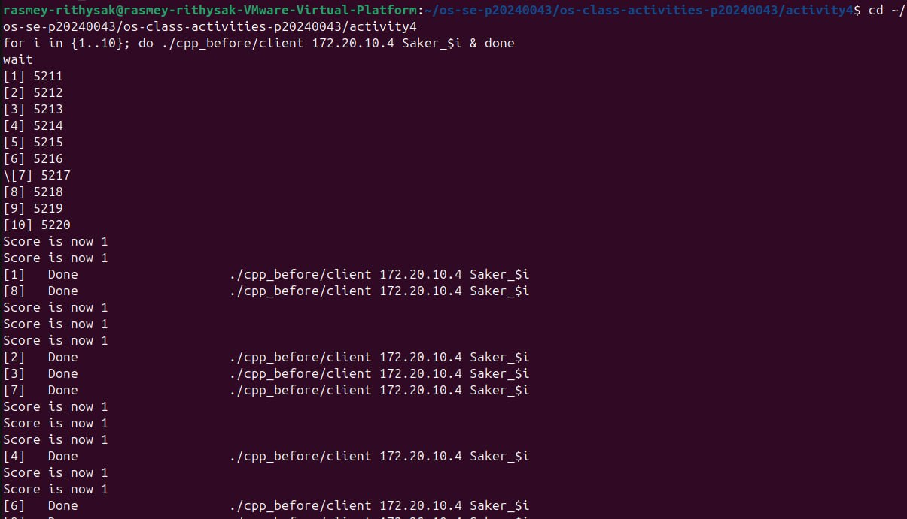
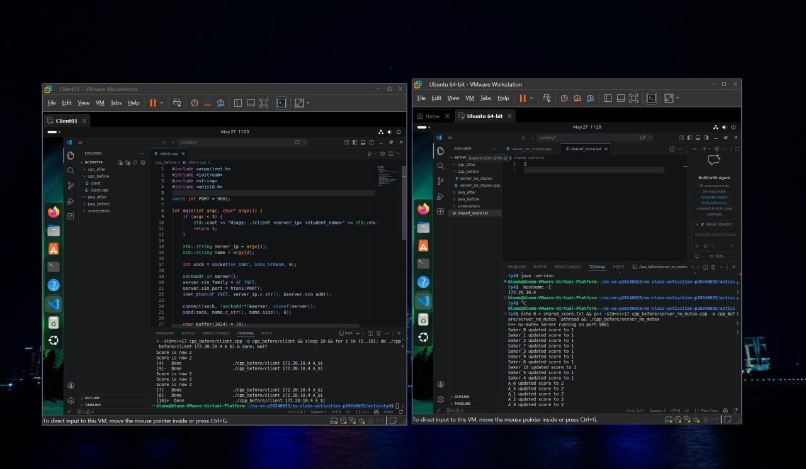
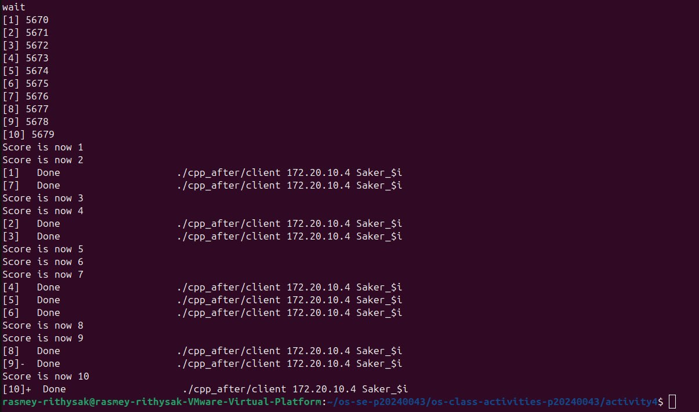
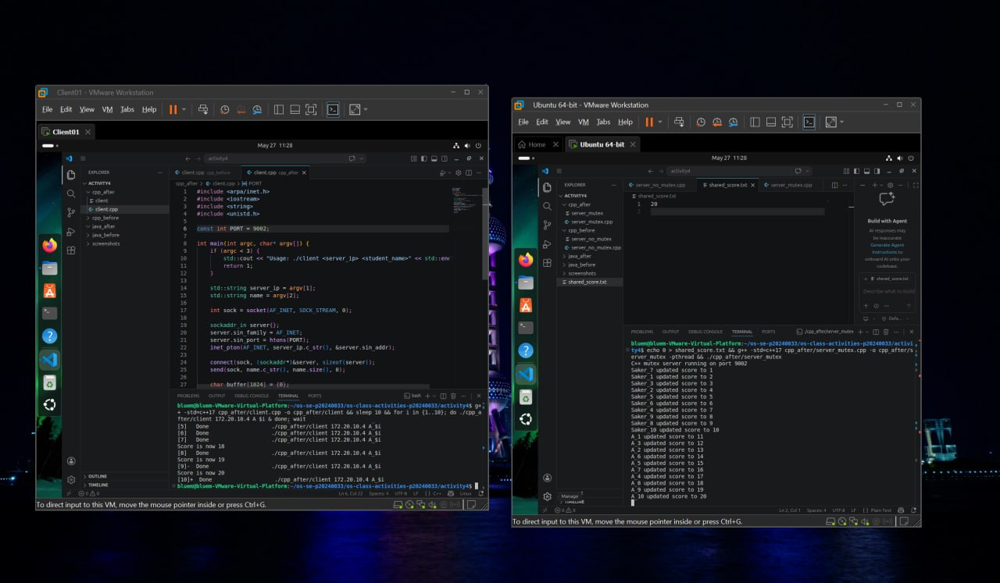
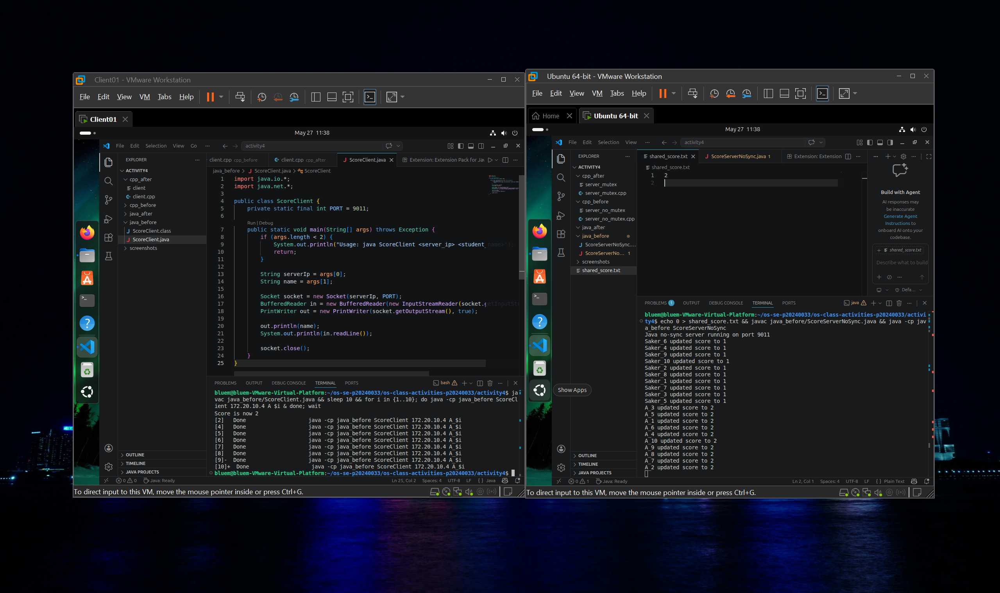
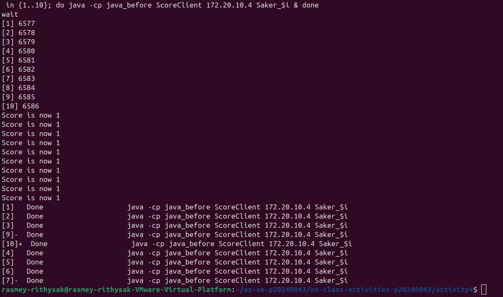
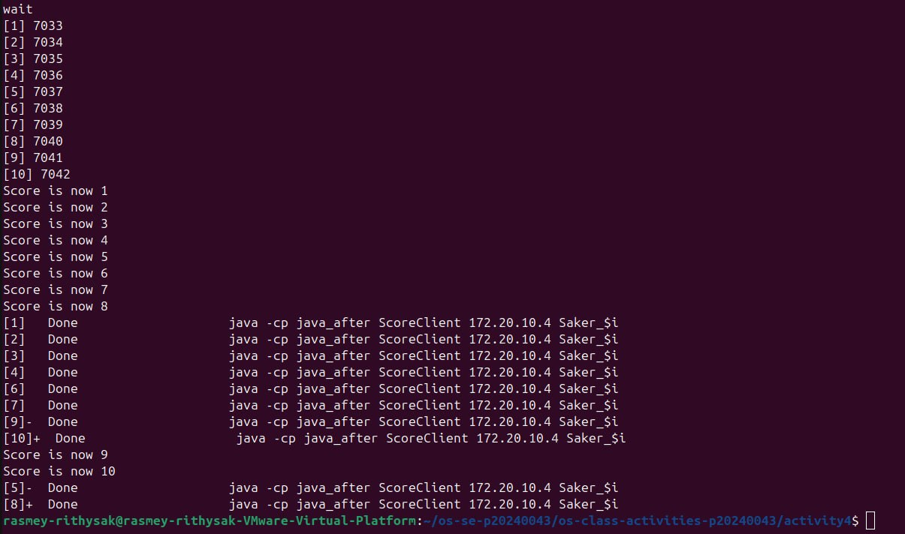
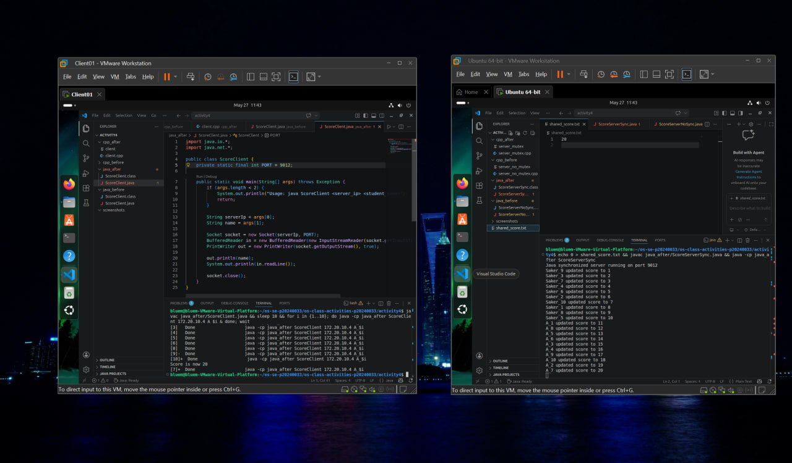

# Class Activity 4 — Shared File API
- Student Name: Rasmey Rithysak
- Student ID: p20240043
- Partner Name: Ouk Puthirith
- Partner Student ID: p20240033
- Server Machine Owner: A
- Server IP Address: 172.20.10.4
---
## Task 1: C++ Before Mutex

- Expected score after 20 total client requests: 20
- Actual score: 1
- What happened: All 10 threads read the score as 0 at the same time, then all wrote 1. Race condition caused lost updates.
---
## Task 2: C++ After Mutex

- Expected score after 20 total client requests: 20
- Actual score: 20
- What changed after adding mutex: std::lock_guard ensured only one thread updated the file at a time, so every increment was counted correctly.
---
## Task 3: Java Before Synchronized

- Expected score after 20 total client requests: 20
- Actual score: 1
- What happened: All 10 Java threads read 0 simultaneously and all wrote 1. Same race condition as C++.
---
## Task 4: Java After Synchronized

- Expected score after 20 total client requests: 20
- Actual score: 20
- What changed after adding synchronized: The synchronized keyword forced threads to execute updateScore one at a time, eliminating the race condition.
---
## Questions
1. Why should clients send requests to the server instead of writing the file directly?
   Because if multiple clients write the file directly at the same time, race conditions are very likely. The server acts as a single controlled point of access, making it easier to manage synchronization.
2. Why does the server still have a race condition before mutex or synchronized?
   The server creates one thread per client. Without synchronization, multiple threads can read the file at the same time, all see the same value, and all write the same incremented value back — losing updates.
3. In the C++ fixed version, what does std::lock_guard<std::mutex> protect?
   It protects the entire file update block — reading the score, sleeping, incrementing, and writing back — so only one thread can execute that section at a time.
4. In the Java fixed version, what does synchronized protect?
   It protects the updateScore method so only one thread can run it at a time, preventing concurrent reads and writes to shared_score.txt.
5. Why is the final score expected to be 20 when Student A sends 10 requests and Student B sends 10 requests?
   Because each request should increment the score by 1, and 10 + 10 = 20 total increments. With proper synchronization, none are lost.
6. What could happen if two separate servers update the same file at the same time?
   Even with mutex or synchronized inside one server, two separate server processes have no shared lock. They could both read the same value and overwrite each other, causing lost updates — the same race condition problem.
---
## Reflection
Both C++ and Java solve the race condition but in different ways. C++ uses std::mutex with std::lock_guard which automatically releases the lock when it goes out of scope. Java uses the synchronized keyword directly on the method, which is simpler to write. Both approaches ensure only one thread accesses the shared file at a time. This activity showed that even when a server controls a shared resource, synchronization is still necessary when the server handles multiple clients concurrently using threads.
