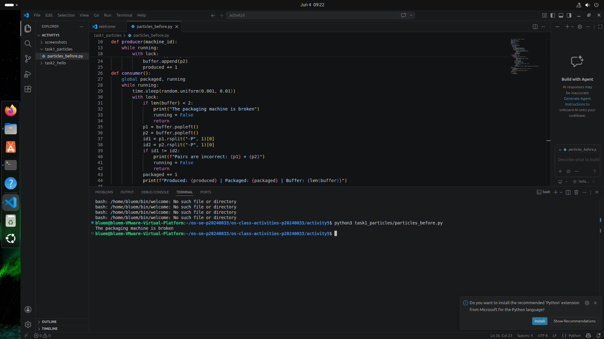
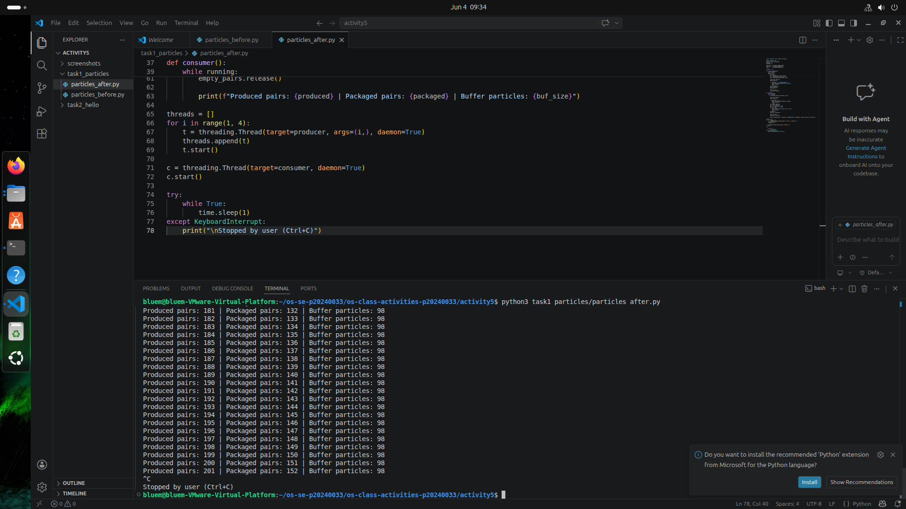
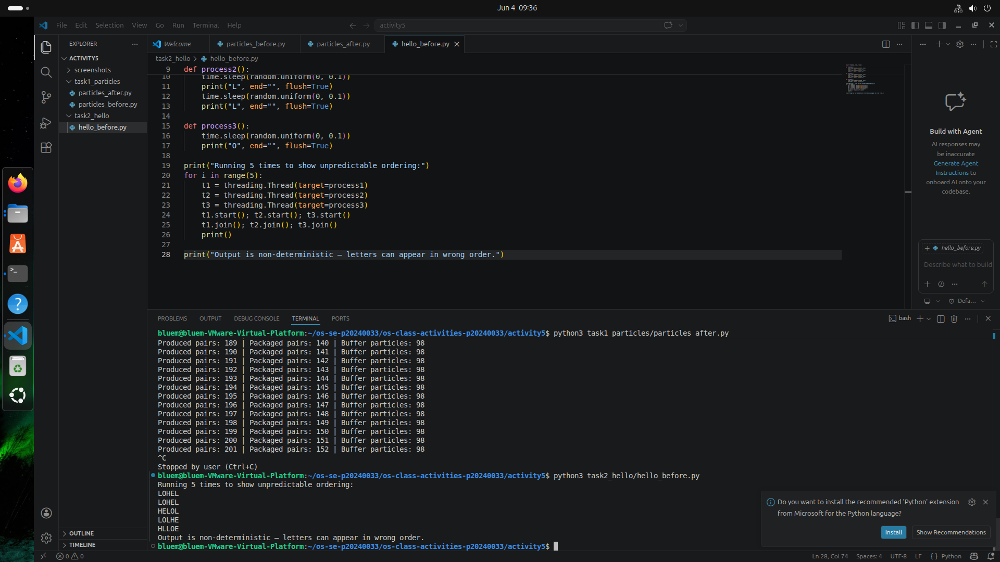
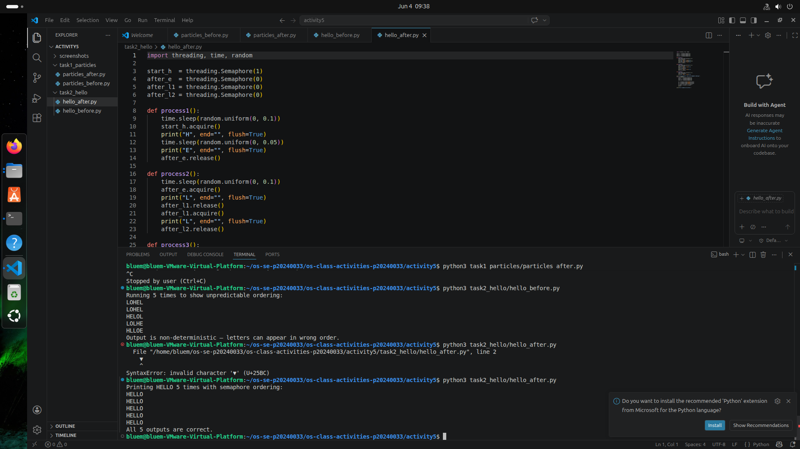

# Class Activity 5 - Semaphores

- **Student Name:** Ouk Puthirith
- **Student ID:** p20240033
- **Programming Language Used:** Python 3

---

## Task 1A: Particle Pair Buffer Before Semaphores



- **What error or incorrect behavior appeared:** The program crashed almost immediately with either `"The packaging machine is broken"` (consumer tried to fetch from an empty buffer) or `"Pairs are incorrect"` (two particles from different producers were matched together).
- **Why did this happen without semaphore protection:** Without semaphores, the consumer thread runs freely and does not wait for the producers to place a complete pair into the buffer. The consumer's random sleep interval is shorter than the producers', so it attempts to dequeue particles before any are available. Additionally, because multiple producers write to the shared buffer concurrently without mutual exclusion, particles from different machines can be interleaved in the buffer, causing mismatched pairs to be packaged together.

---

## Task 1B: Particle Pair Buffer After Semaphores



- **Number of producer machines:** 3
- **Buffer capacity:** 100 particles (50 particle pairs)
- **Semaphores used:**
  - `empty_pairs` — initialized to 50; counts available pair slots in the buffer. Each producer acquires one slot before inserting a pair.
  - `full_pairs` — initialized to 0; counts complete pairs ready for packaging. Each producer signals one after inserting; the consumer acquires one before removing.
  - `mutex` — initialized to 1; protects all shared buffer reads and writes so a full pair is always inserted and removed atomically.
- **Produced pair count shown in screenshot:** *(fill in from your screenshot)*
- **Packaged pair count shown in screenshot:** *(fill in from your screenshot)*
- **Did any error appear during normal operation?** No. The program ran continuously with no error messages until stopped with Ctrl+C.

---

## Task 2A: HELLO Before Semaphores



- **Output before semaphore ordering:** The five output lines showed mixed letter ordering, for example `LOHEL`, `HLLEO`, or `LLOHE`. The output was non-deterministic — each run could produce a different wrong result.
- **Why this output can be wrong or unpredictable:** All three threads start at the same time and each sleeps for a random duration before printing. The operating system scheduler decides which thread runs first, and there is no mechanism to enforce any ordering between them. Whichever thread wakes up earliest prints first, regardless of whether its letter belongs at that position in the word.

---

## Task 2B: HELLO After Semaphores



- **Processes or threads used:** 3 threads — Process 1 (prints H and E), Process 2 (prints L and L), Process 3 (prints O)
- **Semaphores used:**
  - `start_h` — initialized to 1; allows Process 1 to begin printing H immediately.
  - `after_e` — initialized to 0; Process 1 signals this after printing E, unblocking Process 2.
  - `after_l1` — initialized to 0; Process 2 signals this to itself after printing the first L, allowing it to proceed to the second L.
  - `after_l2` — initialized to 0; Process 2 signals this after the second L, unblocking Process 3 to print O.
- **Final output:**
  ```
  HELLO
  HELLO
  HELLO
  HELLO
  HELLO
  All 5 outputs are correct.
  ```

---

## Questions

**1. In Task 1, why does a producer need to wait before adding a pair to the buffer?**

> A producer must wait on `empty_pairs` before adding a pair to ensure there are at least two free slots in the buffer. If all 50 pair slots are already occupied (100 particles in the buffer) and a producer adds more without waiting, the buffer overflows its capacity of 100. The semaphore prevents this by blocking the producer until the consumer has removed a pair and freed a slot.

**2. In Task 1, why does the consumer need to wait before removing a pair from the buffer?**

> The consumer waits on `full_pairs` to ensure at least one complete pair is present in the buffer before it attempts to dequeue two particles. Without this wait, the consumer could run when the buffer is empty or contains only one particle, causing an underflow error (`"The packaging machine is broken"`) or an attempt to read a particle that does not exist yet.

**3. Which semaphore protects the critical section in your particle buffer program?**

> The `mutex` semaphore (initialized to 1) protects the critical section. Both producers and the consumer acquire `mutex` before touching the shared `buffer` deque and release it immediately after. This ensures that the two particles of a pair are always appended consecutively by one producer without another thread inserting particles in between, and that the consumer always removes exactly the two particles that form one complete pair.

**4. How does your program verify that P1 and P2 belong to the same pair?**

> Each particle is labelled with the format `M{machine_id}-{pair_id}-P1` or `M{machine_id}-{pair_id}-P2`. When the consumer dequeues two particles, it strips the `-P1` or `-P2` suffix from each label and compares the remaining prefix strings. For example, `M2-17-P1` and `M2-17-P2` both reduce to `M2-17`, so they match and are a valid pair. If the prefixes differ — for instance `M2-17` versus `M4-88` — the program prints `"Pairs are incorrect"` and stops.

**5. In Task 2, why can the program print letters in the wrong order without semaphores?**

> Without semaphores, all three threads are started at the same time and each independently sleeps for a random interval before printing its letters. The thread scheduler is free to run them in any order. There is no dependency or signal between the threads, so Process 3 (O) can wake up before Process 1 (H) and print its letter first. The randomness of the sleep durations means the output order changes every run and is never reliably `HELLO`.

**6. Which semaphore or synchronization step forces H to print before E, L, L, and O?**

> The `start_h` semaphore (initialized to 1) gives Process 1 the exclusive right to begin. It acquires `start_h` first, prints `H`, then prints `E`, and only then signals `after_e`. Because `after_e` starts at 0, Process 2 is blocked and cannot print `L` until Process 1 has finished printing both `H` and `E`. The chain continues: Process 2 signals `after_l2` only after both `L`s are printed, which unblocks Process 3 to print `O`. Every letter is therefore strictly ordered behind the one before it.

**7. What could cause deadlock in either of your simulations?**

> In Task 1, deadlock could occur if the acquire order of `mutex` and a counting semaphore were reversed. For example, if a producer acquired `mutex` first and then blocked on `empty_pairs` (because the buffer is full), while the consumer was also blocked waiting for `mutex` to release before it could remove a pair — neither thread could proceed. The correct design always acquires the counting semaphore (`empty_pairs` or `full_pairs`) before `mutex`.
>
> In Task 2, deadlock could occur if two processes each held a semaphore the other needed, forming a circular wait. For instance, if Process 2 waited on `after_e` while Process 1 was waiting on a signal from Process 2 — neither could proceed. The strict linear chain design (each semaphore is signalled by exactly one process and waited on by exactly one other) eliminates any possibility of circular dependency.

---

## Reflection

These simulations made the value of semaphores concrete in two distinct ways. In Task 1, the counting semaphores (`empty_pairs` and `full_pairs`) acted as resource budgets — they prevented the buffer from being accessed when it was not in a safe state, without the producer or consumer needing to poll or check a condition manually. The mutex showed that even correct counting is not enough: atomicity of multi-step operations (inserting two particles as one unit) also requires explicit protection. In Task 2, semaphores were used not to limit access to a resource but purely to enforce a sequence of events across independent threads. This showed that the same primitive can solve two fundamentally different problems: resource counting and execution ordering. The before-and-after comparison in both tasks made it clear that concurrent code without synchronization is unpredictable by design — not just occasionally wrong, but structurally unsafe.