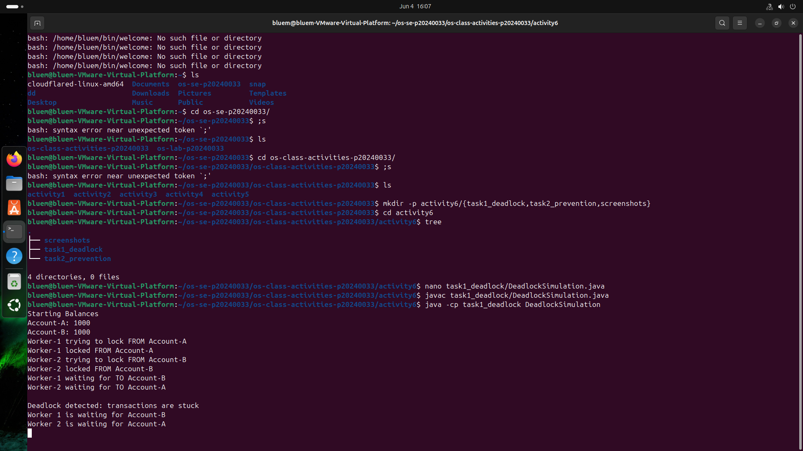
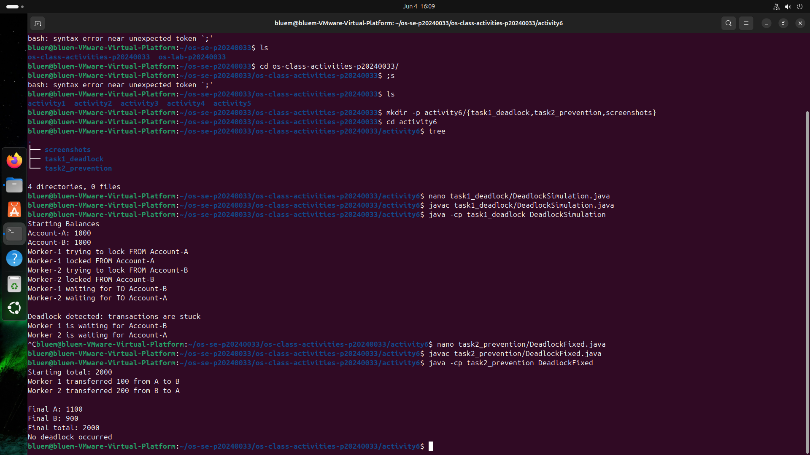

# Class Activity 6 - Deadlock Simulation

* **Student Name:** Ouk Puthirith
* **Student ID:** p20240033
* **Programming Language Used:** Java

---

## Task 1: Deadlock Version



* **Shared resources:** Account-A and Account-B (each protected by a semaphore lock)
* **Transaction 1:** Transfer 100 from Account-A to Account-B
* **Transaction 2:** Transfer 200 from Account-B to Account-A
* **Deadlock message shown:** `Deadlock detected: transactions are stuck`
* **Explanation of why the program got stuck:**
  Worker 1 acquired the lock for Account-A and then waited for Account-B. At the same time, Worker 2 acquired the lock for Account-B and waited for Account-A. Since each worker was waiting for a resource held by the other worker, neither could continue, resulting in a deadlock.

---

## Task 2: Deadlock Prevention Version



* **Prevention strategy used:** Single shared semaphore mutex protecting the entire transfer operation
* **Semaphore mutex initial value:** 1
* **Starting total:** 2000
* **Final total:** 2000
* **Did both transfers complete?** Yes
* **Why no deadlock occurred:**
  Only one thread could enter the transfer critical section at a time. Because transfers were executed sequentially under a single mutex, no thread could hold one resource while waiting for another, eliminating the possibility of circular wait.

---

## Questions

### 1. What are the two shared resources in your bank transaction simulation?

The two shared resources are Account-A and Account-B. Both threads access and modify these shared account balances during transfers.

### 2. Which line or section of your Task 1 program creates hold-and-wait?

The hold-and-wait condition occurs when a thread acquires the first account lock and then waits to acquire the second account lock:

```java
from.lock.acquire();
Thread.sleep(1000);
to.lock.acquire();
```

### 3. How does Task 1 create circular wait?

Worker 1 holds the lock for Account-A while waiting for Account-B. Worker 2 holds the lock for Account-B while waiting for Account-A. This creates a circular chain of waiting where neither thread can proceed.

### 4. Why does the Task 1 program need a watchdog or timeout?

Without a watchdog or timeout, the program would simply appear to freeze indefinitely. The watchdog detects that no progress has been made and reports the deadlock clearly to the user.

### 5. How does the single semaphore mutex prevent deadlock in Task 2?

The semaphore mutex allows only one thread to perform a transfer at a time. Since threads cannot execute the critical section simultaneously, they cannot become stuck waiting on each other's resources.

### 6. Which of the four deadlock conditions does your Task 2 solution remove or avoid?

The solution removes the **circular wait** condition. Because only one transfer can execute at a time, there is no cycle of threads waiting for resources held by one another.

### 7. Why must the final total bank balance remain unchanged after both transfers?

The transfers only move money between accounts. No money is created or destroyed, so the combined balance of all accounts must remain constant. The starting total and final total should both be 2000.

---

## Reflection

This activity demonstrated how deadlocks can occur when multiple threads compete for shared resources without proper coordination. In real systems such as banking applications, databases, and file systems, deadlocks can cause transactions to stop progressing and may affect system availability. Using synchronization techniques such as mutexes, semaphores, lock ordering, or timeout mechanisms helps prevent these situations. The activity showed the importance of designing concurrent systems carefully to ensure safe resource sharing and reliable operation.
