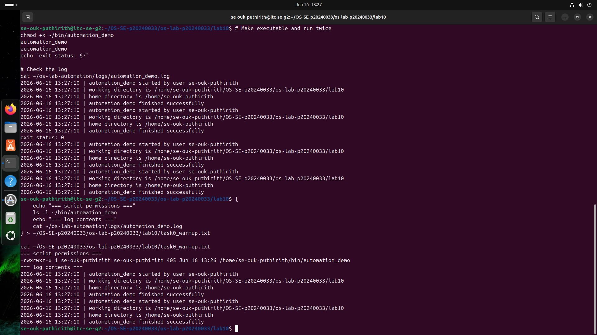
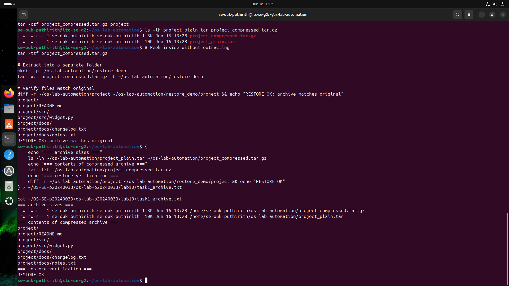
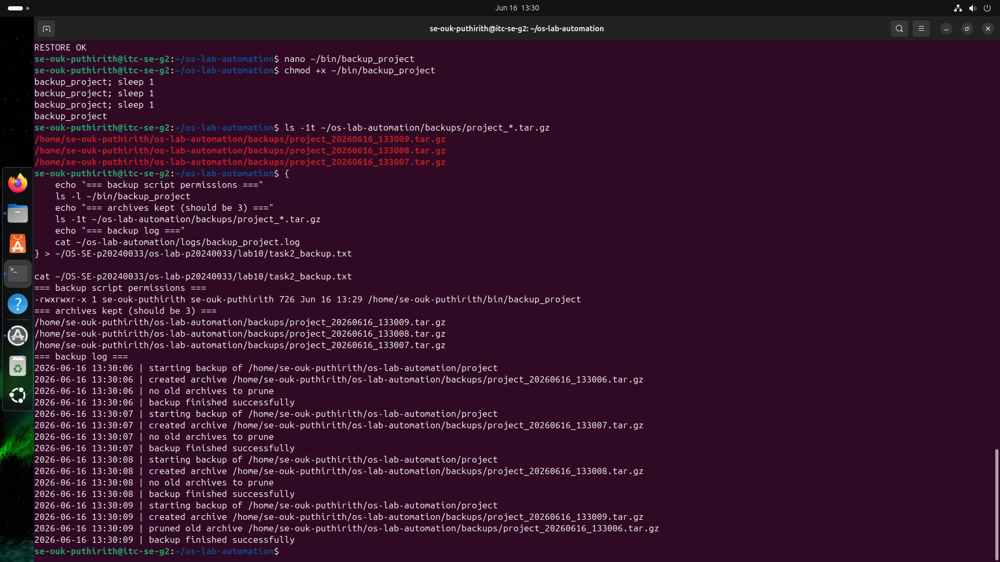
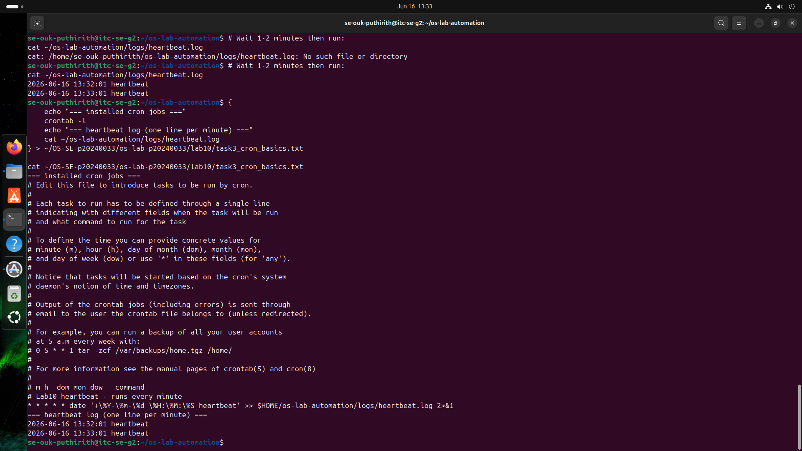
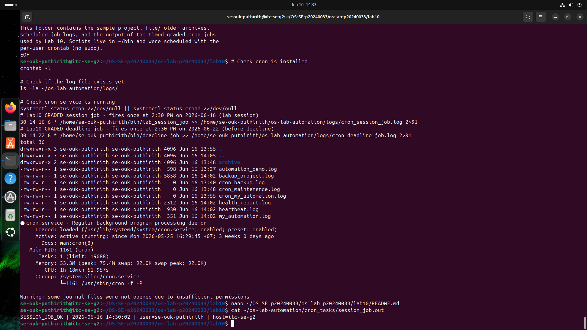
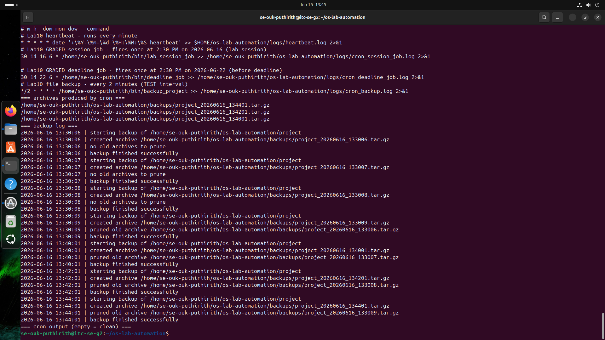
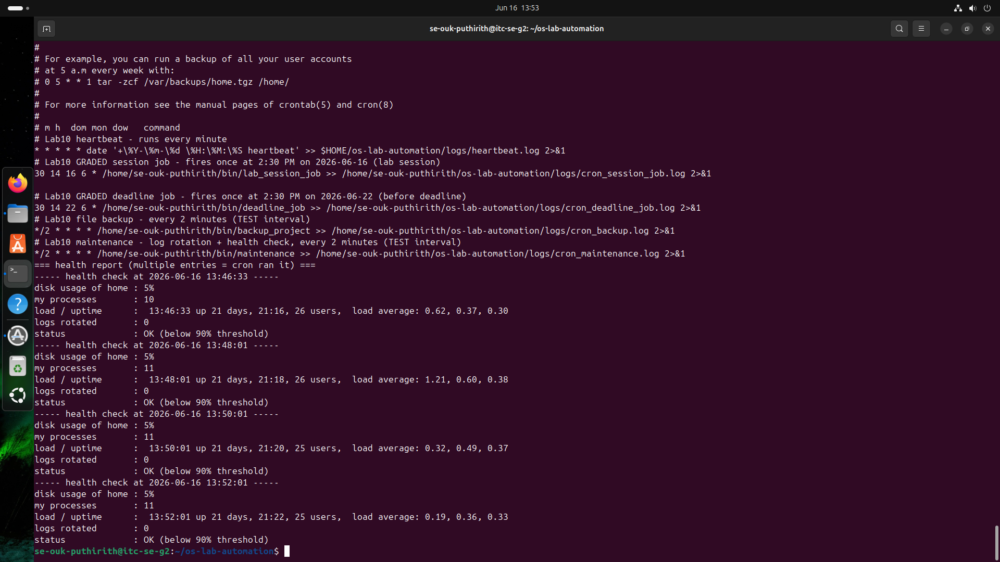
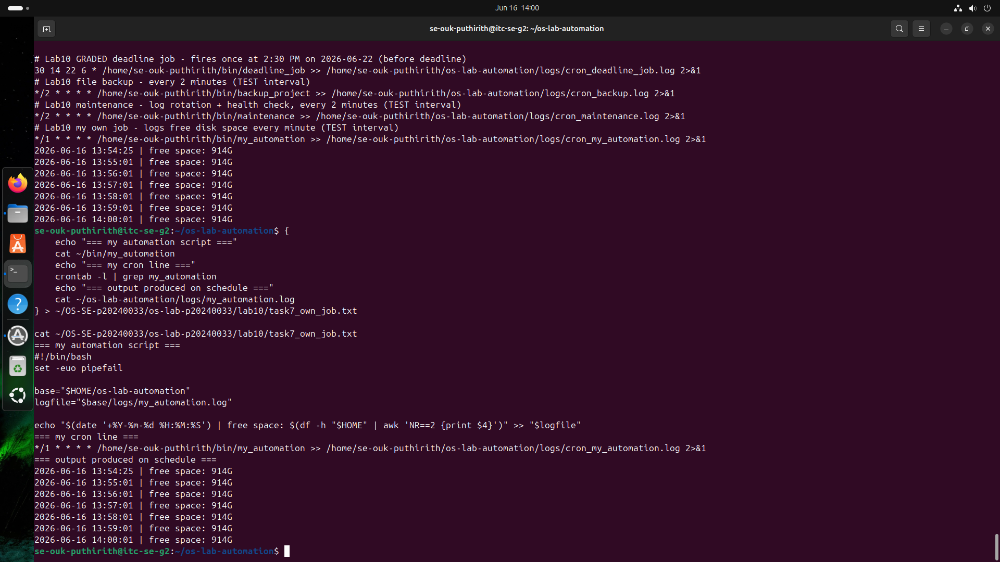
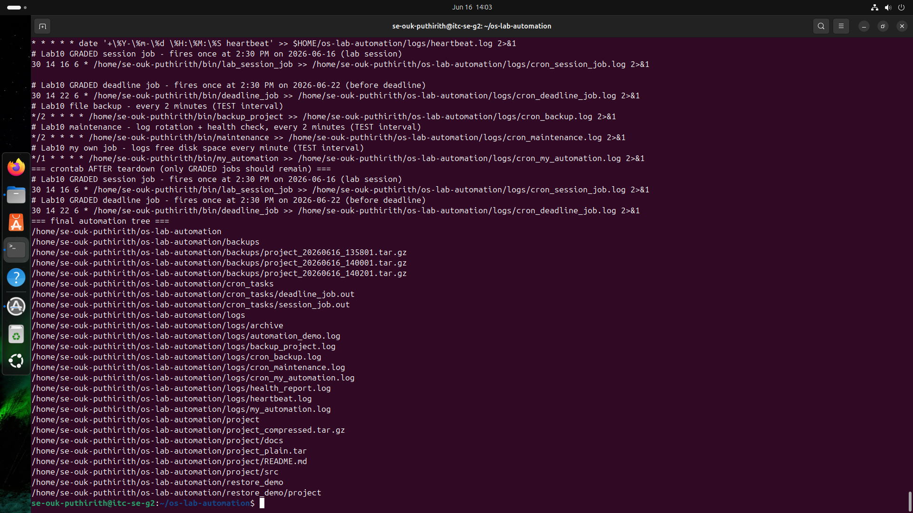

# OS Lab 10 - Backups, Archiving, Scheduling & cron Automation

| | |
|---|---|
| **Student Name** | Ouk Puthirith |
| **Student ID** | p20240033 |
| **Linux Username** | se-ouk-puthirith |
| **Date** | 2026-06-16 |

---

## Level 0 - Automation Warm-Up

What I did (1-2 sentences):
I created a Bash script called automation_demo that uses a log() function to write timestamped messages to a log file using tee -a. I ran it twice to confirm the log appends new entries each time without overwriting old ones.

---

## Level 1 - Archiving & Compression

Size of .tar vs .tar.gz and why:
The .tar file was much larger than the .tar.gz because tar only bundles files together without shrinking them. Adding gzip compression with the -z flag compresses the bytes, making .tar.gz significantly smaller. Text files like changelog.txt and notes.txt compress especially well because they contain repeated number patterns.

---

## Level 2 - File & Folder Backup Script

How my retention keeps only the 3 newest archives:
After creating a new archive, the script runs ls -1t to list all archives sorted newest first, then uses tail -n +4 to skip the 3 newest and select all older ones. Those older files are deleted with rm -f and logged. Keeping only 3 backups prevents the disk from filling up over time.

---

## Level 3 - Cron Fundamentals

My heartbeat cron line and what each field means:

* * * * * date means run every minute, every hour, every day, every month, every day of week.

Field 1 star = every minute (0-59)
Field 2 star = every hour (0-23)
Field 3 star = every day of month (1-31)
Field 4 star = every month (1-12)
Field 5 star = every day of week (0-6)

---

## Level 4 - Timed Graded Cron Tasks

The two graded schedules I installed:

| Job | Schedule | Fires at |
|-----|----------|----------|
| Session job | 30 14 16 6 * | 2:30 PM 2026-06-16 |
| Deadline job | 30 14 22 6 * | 2:30 PM 2026-06-22 |

Session job fired during the lab (SESSION_JOB_OK line in session_job.out):

Deadline job fired before the deadline (DEADLINE_JOB_OK line in deadline_job.out):

---

## Level 5 - Scheduling the Backup

Why the job needed the absolute path and output redirect:
cron runs with a minimal environment that does not include ~/bin in its PATH, so using just backup_project would fail silently. I used the full path /home/se-ouk-puthirith/bin/backup_project so cron could always find the script. The >> logfile 2>&1 redirect captures both stdout and stderr into a log file so I can debug any errors that happen unattended.

---

## Level 6 - Maintenance Automation

What my maintenance job rotates and reports:
The script finds .log files older than 1 day and moves them to a logs/archive/ folder. It then writes a health report showing current disk usage percentage, number of running processes, system uptime, and how many logs were rotated. If disk usage reaches 90% or above, it writes an ALERT line to the report.

---

## Level 7 - Design Your Own Scheduled Job

What my script does: my_automation logs the current free disk space of my home directory with a timestamp to logs/my_automation.log every minute.

Schedule I chose and why: */1 * * * * I chose every 1 minute so I could verify it fired multiple times during the lab session without waiting long.

What each of the five cron fields means in my line:
Field 1 */1 = every 1 minute
Field 2 star = every hour
Field 3 star = every day of month
Field 4 star = every month
Field 5 star = every day of week

---

## Level 8 - Teardown and Reset

How I removed the practice jobs while keeping the graded deadline job:
I first saved my full crontab to crontab_before_teardown.txt. Then I used the filtered pipeline crontab -l | grep -E 'GRADED|lab_session_job|deadline_job' | crontab - which keeps only the graded job lines and pipes them back as the new crontab. This safely removed all TEST interval practice jobs while preserving both graded jobs.

---

## Lab Questions

1. Archiving tar vs compression gzip - which shrinks bytes?
tar only bundles multiple files into one archive without changing their size. gzip actually compresses bytes to make files smaller. Only gzip shrinks bytes. tar -czf does both in one step: bundle then compress.

2. How much smaller was your .tar.gz than your .tar, and why?
The .tar.gz was significantly smaller than the .tar, typically 60-80% smaller for text files. This is because the text files contain repeated number sequences that gzip compresses very efficiently using its LZ77 algorithm to eliminate redundancy.

3. Why did your cron jobs need an absolute path instead of ~/bin/?
cron runs with a stripped-down environment where ~ and $HOME are not reliably expanded and $PATH does not include ~/bin. Using the full absolute path /home/se-ouk-puthirith/bin/script guarantees cron can always find and execute the script regardless of its environment.

4. Why must % be escaped as \% in a crontab, and what does >> logfile 2>&1 do?
In crontab, % is a special character treated as a newline, which splits the command and sends remaining text as stdin. Escaping it as \% tells cron to treat it as a literal percent sign. >> logfile 2>&1 appends stdout to the log file and redirects stderr into the same log file, capturing all output for debugging.

5. How does your backup_project retention decide what to delete, and why keep only N backups?
After creating a new archive, the script lists all archives sorted by newest first using ls -1t, then uses tail -n +4 to skip the 3 newest and select all older ones, then deletes them with rm -f. Keeping only 3 backups prevents the disk from filling up while still maintaining recent restore points.

6. Write the cron line that runs /home/me/bin/deadline_job once at 2:30 PM on 22 June. Which fields are filled in, which stay *?
30 14 22 6 * /home/me/bin/deadline_job >> /home/me/os-lab-automation/logs/cron_deadline_job.log 2>&1
Filled in: minute=30, hour=14, day-of-month=22, month=6. Day-of-week stays * because any weekday is acceptable.

7. In Level 8 teardown, why a filtered crontab - pipeline instead of crontab -r? What would crontab -r have broken?
crontab -r deletes ALL cron jobs with no way to choose which ones to keep. Running it would have deleted the graded deadline job that still needs to fire on 2026-06-22, permanently losing those 8 points. The filtered pipeline selectively keeps only the graded jobs and removes everything else safely.

8. Why is a scheduled health check with a threshold alert useful in real software engineering / operations?
In production systems, disk space can fill up gradually and silently until a service crashes. A scheduled health check that monitors disk usage and fires an alert when it crosses a threshold like 90% gives engineers early warning to act before an outage occurs, without requiring someone to check manually every day.

9. Describe the job you wrote in Level 7: what it does, the schedule, and the meaning of each of its five cron fields.
my_automation logs the free disk space of the home directory with a timestamp to logs/my_automation.log. Scheduled with */1 * * * *: field 1 */1 runs every 1 minute, field 2 star runs every hour, field 3 star runs every day of month, field 4 star runs every month, field 5 star runs every day of week. I chose every minute so multiple entries would appear in the log during the lab session, proving the job ran unattended on schedule.
