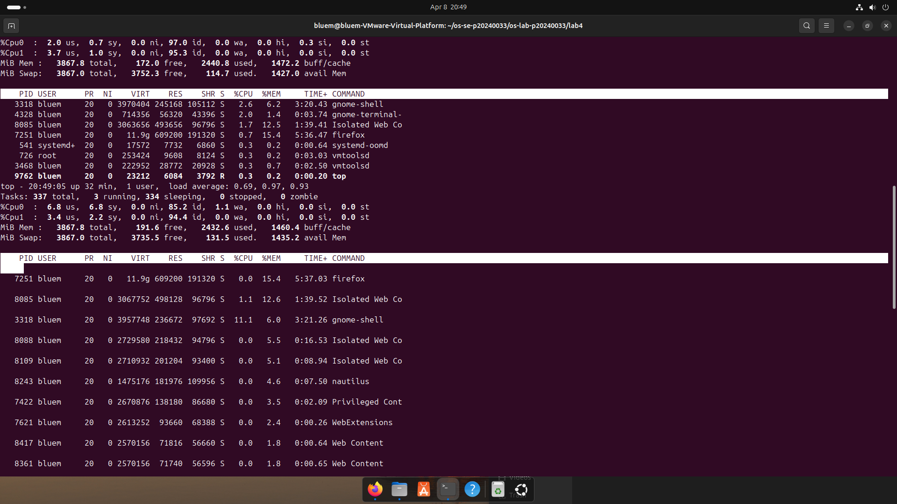
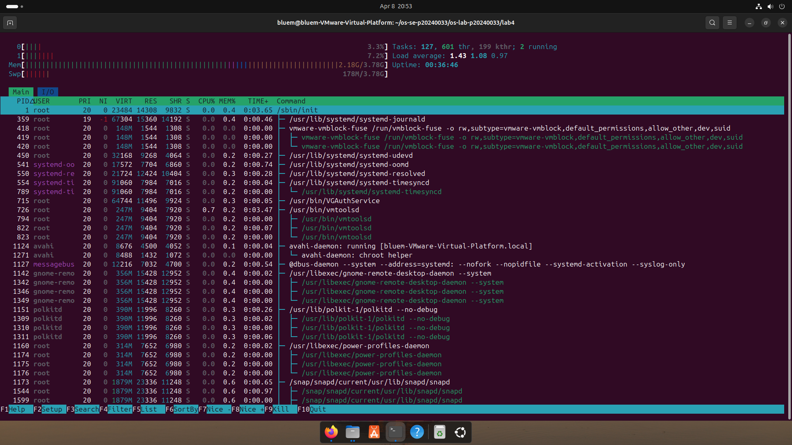
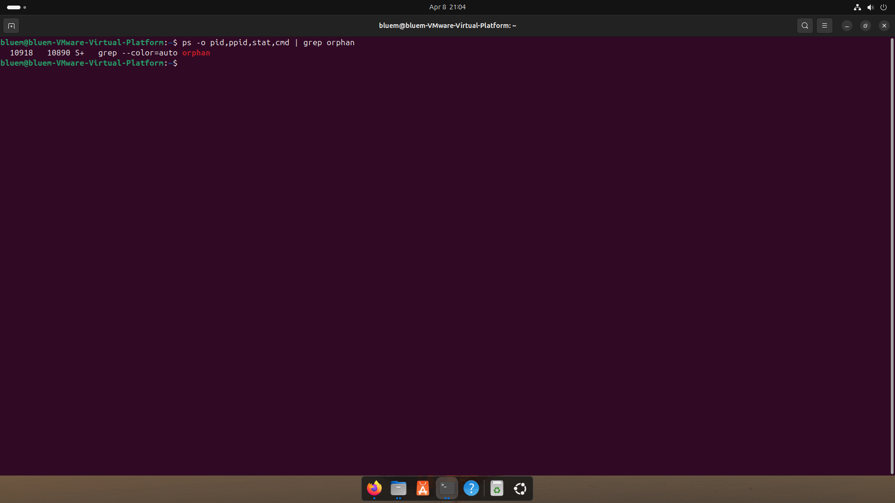
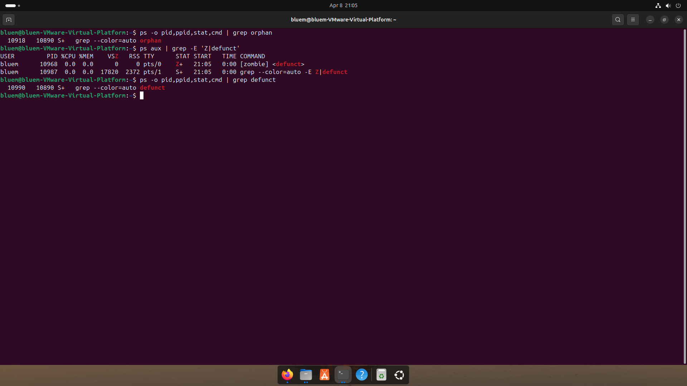

# Lab 4 — I/O Redirection, Pipelines & Process Management
| | |
|---|---|
| **Student Name** | `Ouk Puthirith` |
| **Student ID** | `p20240033` |

## Task Completion
| Task | Output File | Status |
|------|-----------|--------|
| Task 1: I/O Redirection | `task1_redirection.txt` | ☑ |
| Task 2: Pipelines & Filters | `task2_pipelines.txt` | ☑ |
| Task 3: Data Analysis | `task3_analysis.txt` | ☑ |
| Task 4: Process Management | `task4_processes.txt` | ☑ |
| Task 5: Orphan & Zombie | `task5_orphan_zombie.txt` | ☑ |

## Screenshots

### Task 4 — `top` Output

### Task 4 — `htop` Tree View

### Task 5 — Orphan Process (`ps` showing PPID = 1)

### Task 5 — Zombie Process (`ps` showing state Z)

## Answers to Task 5 Questions

1. **How are orphans cleaned up?**
   > When a parent exits before its child, the orphan is adopted by init/systemd (PID 1), which calls wait() to clean it up when it finishes.

2. **How are zombies cleaned up?**
   > A zombie is cleaned up when its parent calls wait(), removing the entry from the process table. If the parent exits without calling wait(), init/systemd adopts and cleans it up.

3. **Can you kill a zombie with `kill -9`? Why or why not?**
   > No. A zombie is already dead and has no running code. It is just an entry in the process table, so there is no process to receive the signal.

## Reflection
> The most useful technique was combining pipes with grep, awk, cut, sort, and uniq to analyze log files and system data. In a real server environment, these tools are essential for parsing logs, monitoring processes, and filtering output without opening files manually.