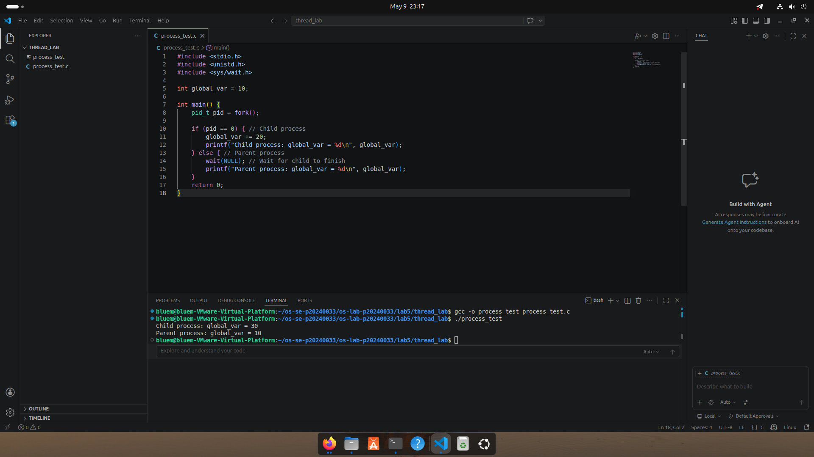
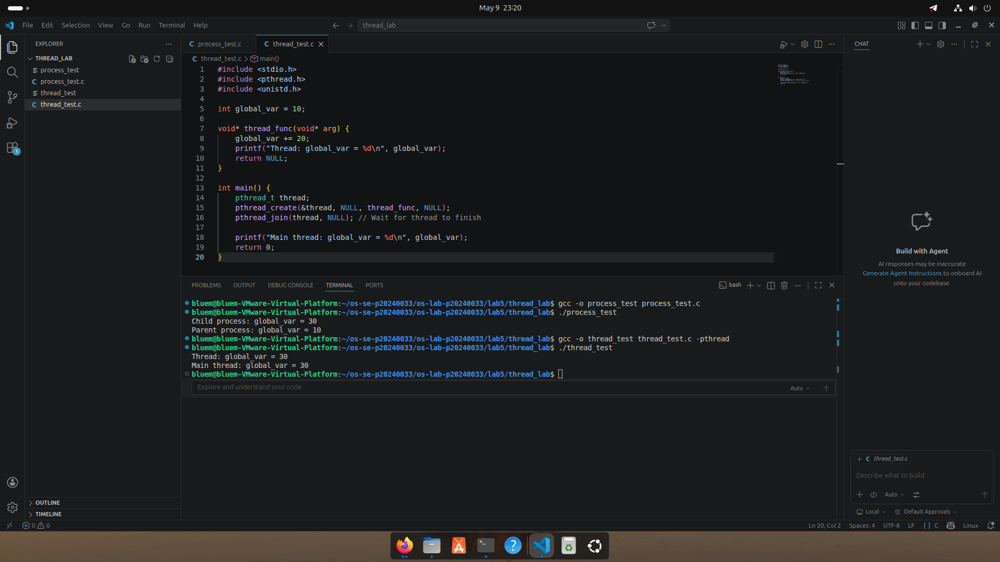
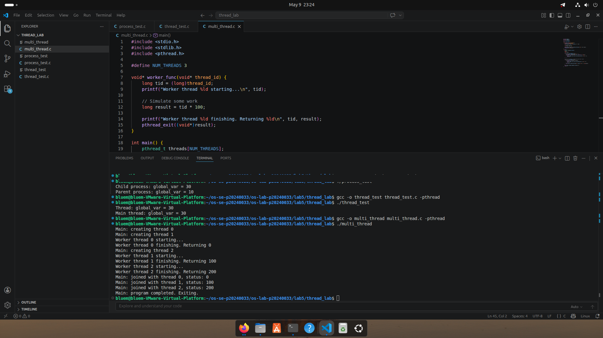
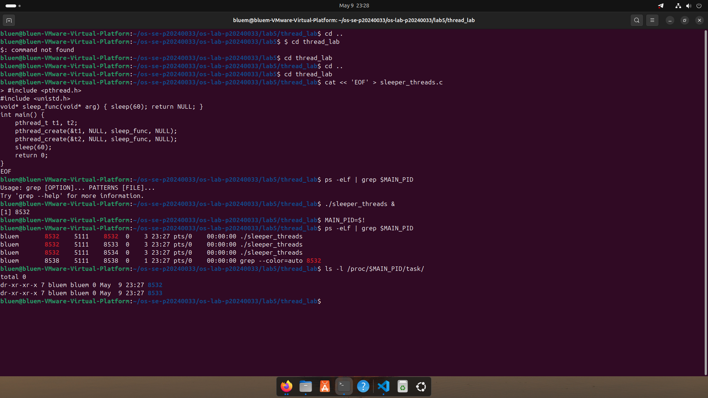
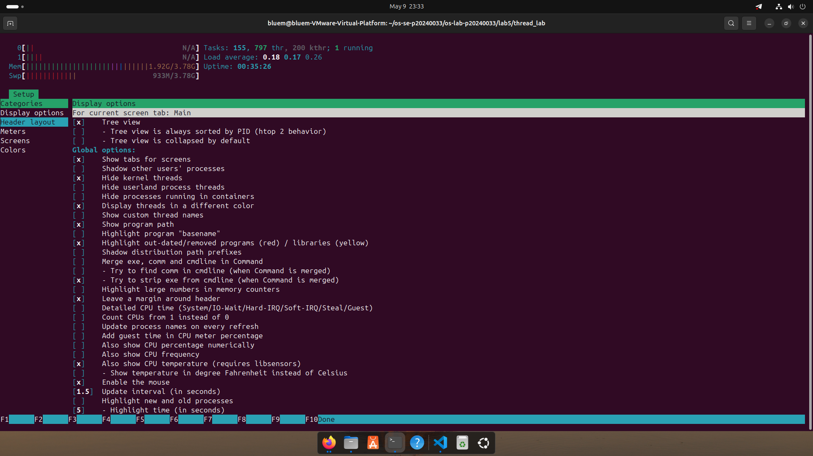
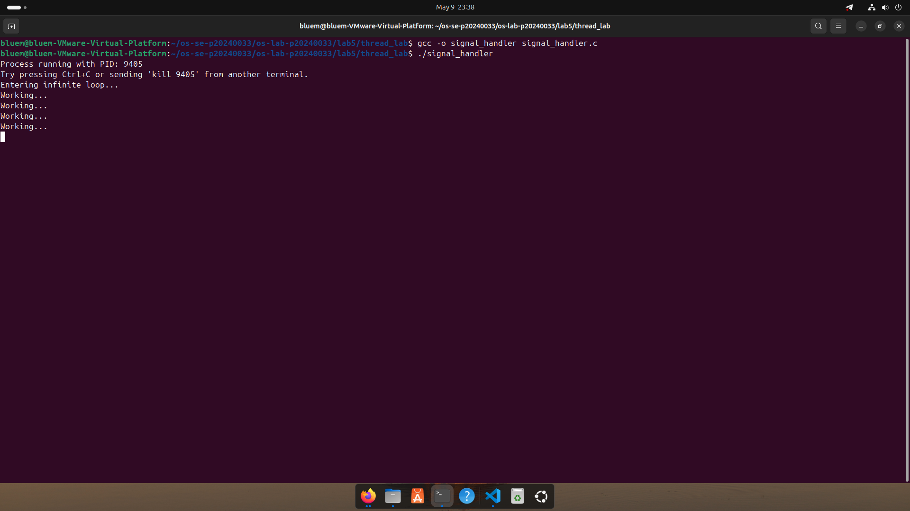
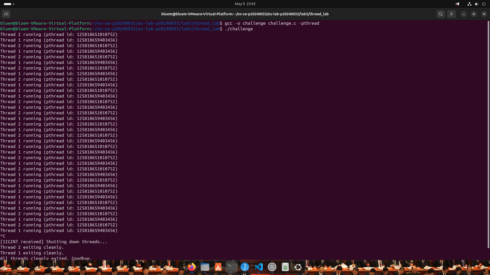

# OS Lab 5 Submission — Threads, Kernel Workers & Process Signals

- **Student Name:** Ouk Puthirith
- **Student ID:** P20240033

---

## Task Output Source Files

- [ ] `process_test.c`
- [ ] `thread_test.c`
- [ ] `multi_thread.c`
- [ ] `sleeper_threads.c`
- [ ] `signal_handler.c`
- [ ] `challenge.c`

---

## Screenshots

### Screenshot 1 — Task 1: Process vs Thread (Process Test)
Show the output of `process_test.c`.

---

### Screenshot 2 — Task 1: Process vs Thread (Thread Test)
Show the output of `thread_test.c`.

---

### Screenshot 3 — Task 2: Thread Interaction
Show the output of `multi_thread.c`.

---

### Screenshot 4 — Task 3: Visualizing 1:1 Thread Mapping
Show the `ps -eLf` output or `/proc/[pid]/task/` directory visualizing the LWP mapping for user threads.

---

### Screenshot 5 — Task 3: `htop` Kernel Threads
Show `htop` visualizing kernel threads (bracketed names like `[kworker]`).

---

### Screenshot 6 — Task 4: Catching `SIGINT`
Show the output of `signal_handler` gracefully catching `Ctrl+C`.

---

### Screenshot 7 — Challenge: Graceful Multithreaded Shutdown
Show the output of `challenge.c` joining its threads and exiting gracefully after receiving `Ctrl+C`.

---

## Answers to Lab Questions

1. **Why do threads share memory while processes do not (by default)?**

   > Processes are created via `fork()`, which gives each process its own virtual address space using copy-on-write. Changes in one process do not affect the other. Threads are created within the same process and share the same virtual address space, heap, and global variables — only the stack is private per thread. This is why the child process modifying `global_var` had no effect on the parent, but a thread's modification was visible to `main`.

2. **Based on the 1:1 mapping, what is the role of an LWP (Lightweight Process) in Linux?**

   > In Linux's 1:1 threading model, every user-level thread is backed by a kernel-level Lightweight Process (LWP). An LWP is a schedulable entity the kernel sees and assigns CPU time to. This means user threads are directly scheduled by the kernel, enabling true parallelism on multi-core systems. The `LWP` column in `ps -eLf` and the subdirectories in `/proc/[pid]/task/` each represent one of these kernel-level thread entries.

3. **Why is it restricted to send signals to kernel threads (e.g., `kthreadd` or `kworker`)?**

   > Kernel threads run entirely in kernel space and perform critical system functions like memory management, I/O scheduling, and interrupt handling. They are created and managed by the kernel itself (parented under `kthreadd`, PPID 2) and are not subject to user-space process control. Allowing arbitrary signals to reach them could crash or destabilize the entire system, so the kernel protects them by ignoring or rejecting such signals even from root.

4. **Why can't `SIGKILL` (kill -9) be caught by a signal handler?**

   > `SIGKILL` is handled entirely by the kernel and never delivered to the process's signal handler. This is intentional — if a process could catch `SIGKILL`, a buggy or malicious program could make itself impossible to terminate. By keeping `SIGKILL` uncatchable and unignorable, the OS always retains the ability to forcibly remove any process. The `signal(SIGKILL, ...)` call returns `SIG_ERR` confirming this restriction.

---

## Reflection

> The most challenging part was coordinating a clean shutdown between threads and a signal handler in `challenge.c`. Signal handlers run asynchronously and cannot safely call most library functions, so using a `volatile` flag as the communication mechanism was the right approach — without `volatile`, the compiler might cache `keep_running` in a register and worker threads would never see the update.
>
> These concepts apply directly to large-scale systems. Web servers like Nginx use multi-threaded worker models to handle concurrent connections while sharing resources through shared memory. Graceful shutdown (catching `SIGTERM` to drain active requests before exiting) is a standard production requirement. Databases like PostgreSQL use background threads for checkpointing and vacuuming that must also coordinate shutdown cleanly to avoid data corruption. Understanding thread lifecycle, signal safety, and the kernel's scheduling role is foundational to building reliable server software.
