# OS Lab 6 Submission — Linux Security, Users, Groups & File Permissions

| | |
|---|---|
| **Student Name** | Ouk Puthirith |
| **Student ID** | p20240033 |
| **Course** | Operating Systems |
| **Lab Title** | Linux Security: Users, Groups & File Permissions |
| **Duration** | 3 Hours |
| **Lab Type** | Individual |

---

## Task Output Files

Make sure all of the following files are present in your `lab6/` folder:

- [x] `task1_users.txt`
- [x] `task2_groups.txt`
- [x] `task3_permissions.txt`
- [x] `task3_stat_output.txt`
- [x] `task4_special_bits.txt`
- [x] `task5_acl.txt`
- [x] `security_lab/whoami_suid.c`

---

## Screenshots

### Screenshot 1 — Task 1: User Creation

Show `cat task1_users.txt` confirming both `dev_alice` and `dev_bob` accounts exist.

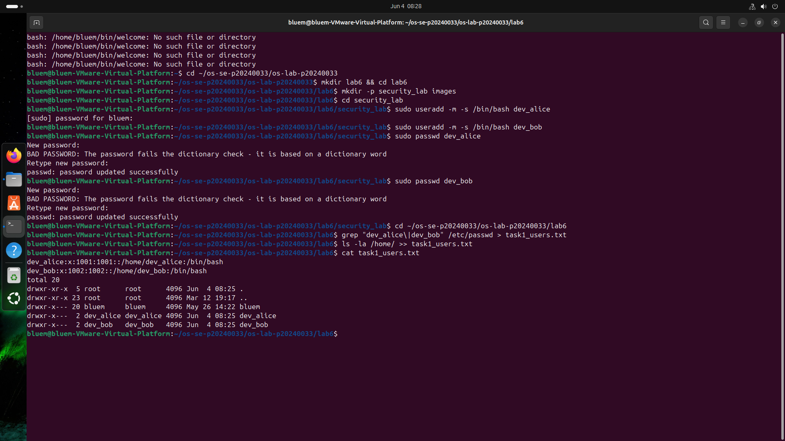

---

### Screenshot 2 — Task 1: User Modification

Show the updated `/etc/passwd` entry for `dev_alice` with the GECOS comment field.

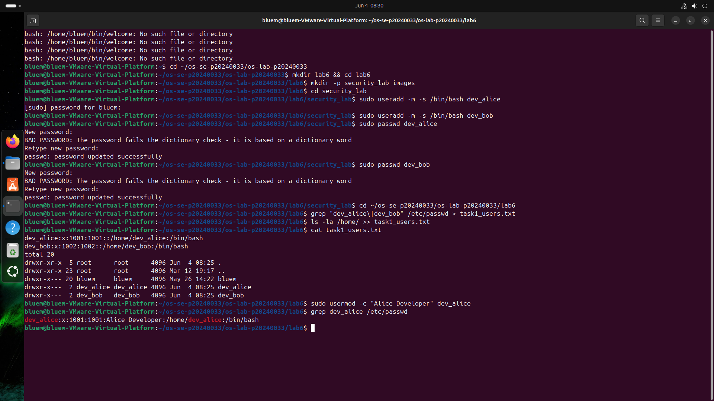

---

### Screenshot 3 — Task 2: Group Setup

Show `cat task2_groups.txt` with group membership for both users.

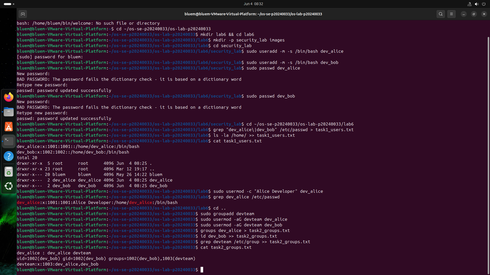

---

### Screenshot 4 — Task 2: Multiple Group Membership

Show `id dev_alice` confirming membership in both `devteam` and `auditors`.

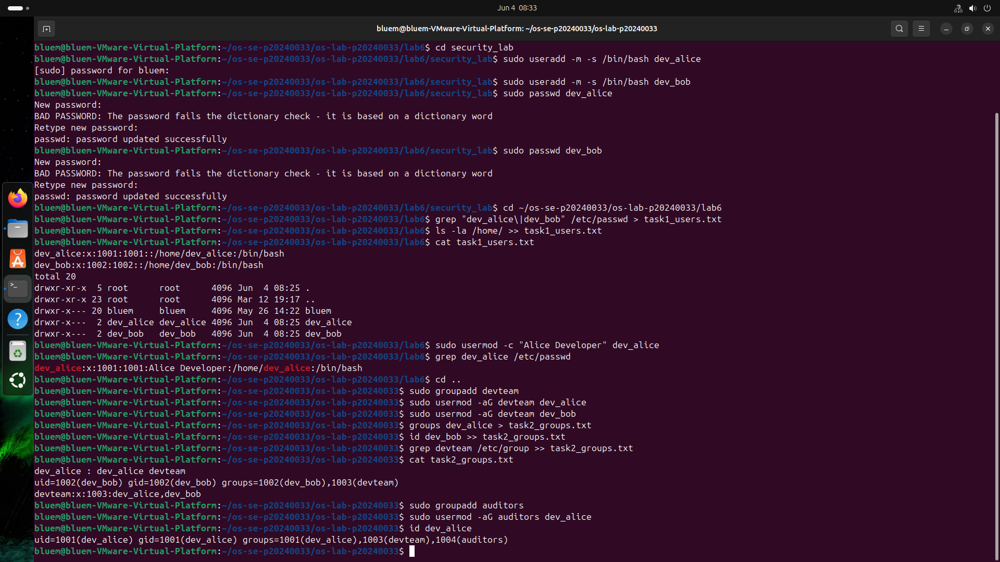

---

### Screenshot 5 — Task 3: Directory Permissions

Show `cat task3_permissions.txt` with `drwxrwx---` on the project directory.

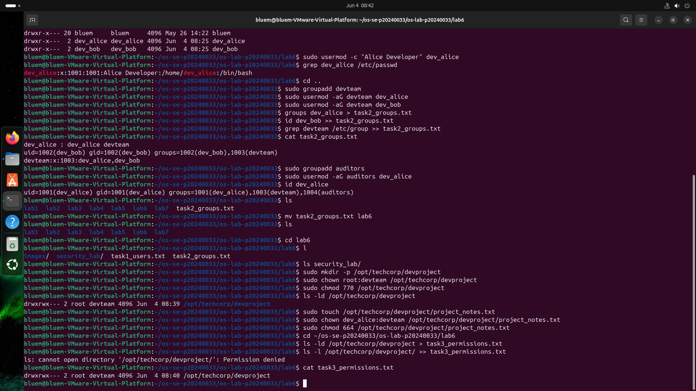

---

### Screenshot 6 — Task 3: Access Denied

Show the `Permission denied` error when `temp_user` tries to access the project directory.

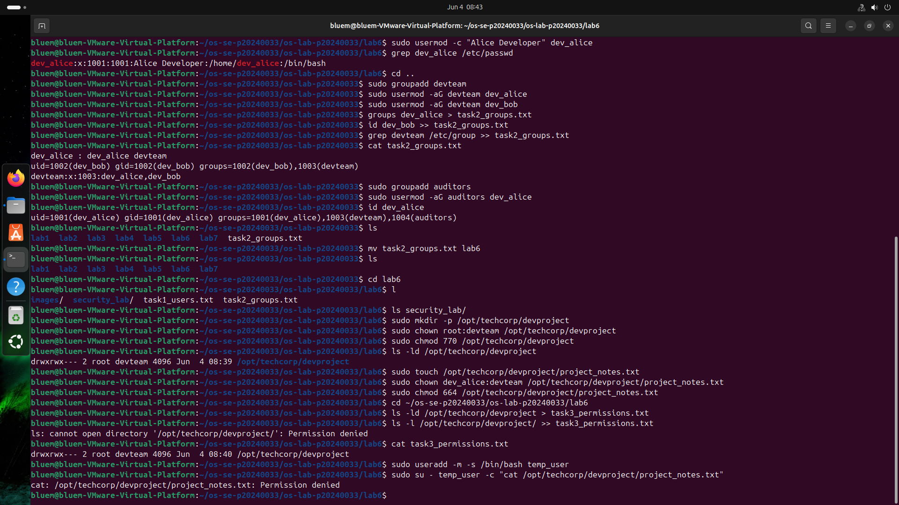

---

### Screenshot 7 — Task 4: setgid Bit

Show the directory listing with `s` in the group execute position, and `bob_file.txt` inheriting the `devteam` group.

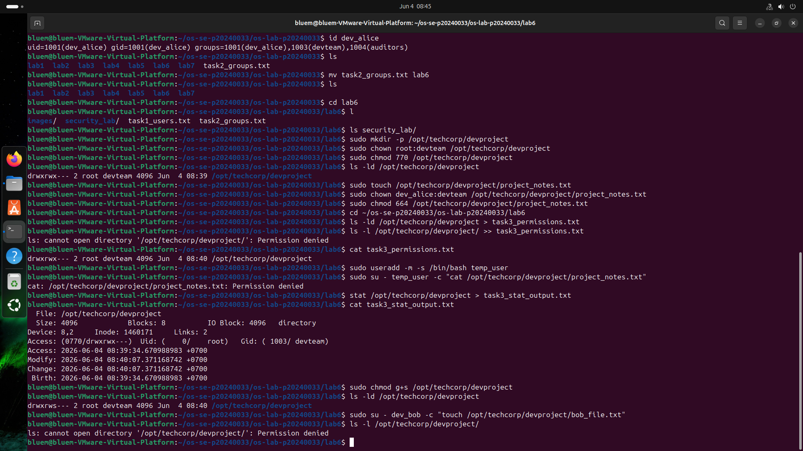

---

### Screenshot 8 — Task 4: Sticky Bit

Show the `t` bit in the directory listing and the `Operation not permitted` error when `dev_bob` tries to delete `dev_alice`'s file.

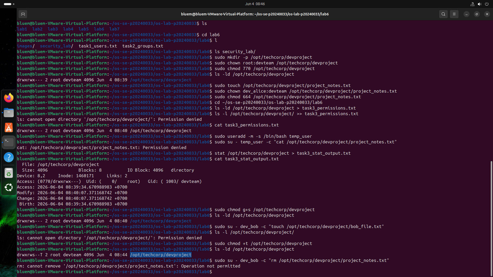

---

### Screenshot 9 — Task 4: setuid Bit

Show `ls -l whoami_suid` with `s` in the owner execute position and the program's UID output.

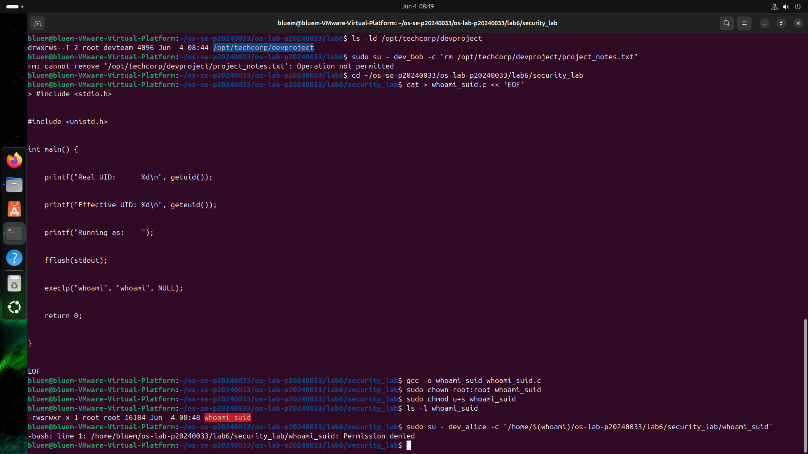

---

### Screenshot 10 — Task 5: ACL Directory

Show `getfacl /opt/techcorp/devproject` with the `auditors` ACE.

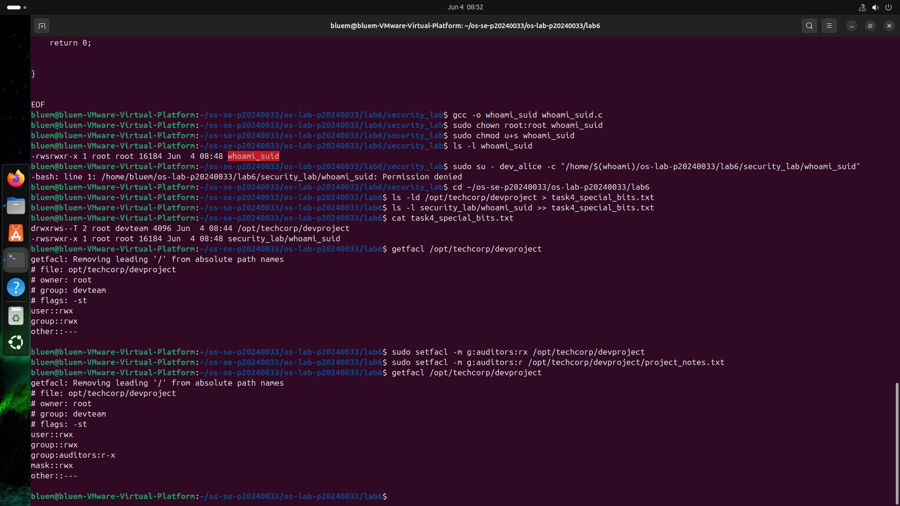

---

### Screenshot 11 — Task 5: ACL Access Test

Show `dev_alice` successfully accessing the file and `temp_user` being denied.

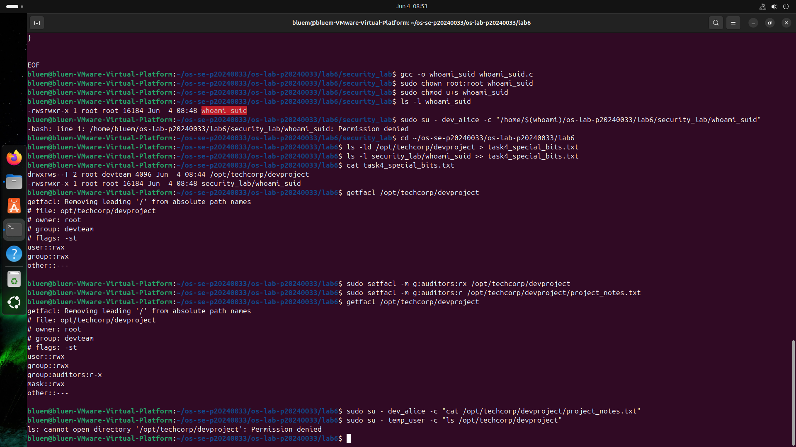

---

### Screenshot 12 — Task 5: ACL Output File

Show `cat task5_acl.txt` with the full ACL entries.

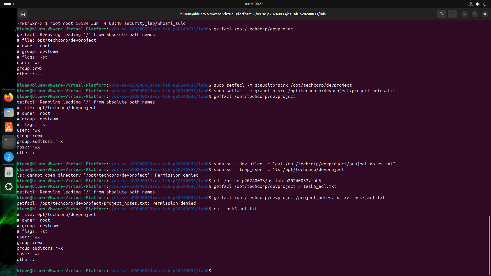

---

## Answers to Lab Questions

**1. What is the difference between `userdel` and `userdel -r`?**

> `userdel` removes only the user account entry from `/etc/passwd`, `/etc/shadow`, and `/etc/group`, but leaves the user's home directory and mail spool on disk. `userdel -r` does everything `userdel` does and also deletes the user's home directory (e.g. `/home/dev_alice`) and all its contents. For this lab, `userdel -r` is the safer cleanup choice because it avoids leaving orphaned files owned by a now-deleted UID.

**2. Why is it safer to use `visudo` instead of directly editing `/etc/sudoers`?**

> `visudo` locks the file to prevent simultaneous edits, and — most importantly — validates the syntax before saving. If you introduce a syntax error in `/etc/sudoers` by editing it directly with `nano` or `vim`, `sudo` becomes completely broken and no user (including root via sudo) can escalate privileges until the file is fixed from a root shell. `visudo` catches the error and refuses to save, keeping the system recoverable.

**3. What happens when a `setgid` directory contains files created by different users? What benefit does this provide for team collaboration?**

> Normally, a new file inherits the primary group of the user who created it. With the `setgid` bit set on a directory, every file created inside automatically inherits the directory's group instead — in this lab, `devteam`. This means `bob_file.txt` created by `dev_bob` is still owned by `devteam`, so `dev_alice` (also in `devteam`) can read and write it without any manual `chown` or `chgrp`. The whole team gets consistent group ownership on shared files without any extra administration.

**4. What limitation of standard Unix permissions does the ACL system solve?**

> Standard Unix permissions only allow one owner, one group, and an "others" category per file. You cannot grant different permissions to a second group or a specific third user without changing the file's group or opening it up to everyone. ACLs solve this by allowing multiple named entries — for example, granting `auditors` read-only access to `/opt/techcorp/devproject` while keeping `devteam` as the controlling group with full access. This enables fine-grained, per-user and per-group permission rules that the traditional rwx model cannot express.