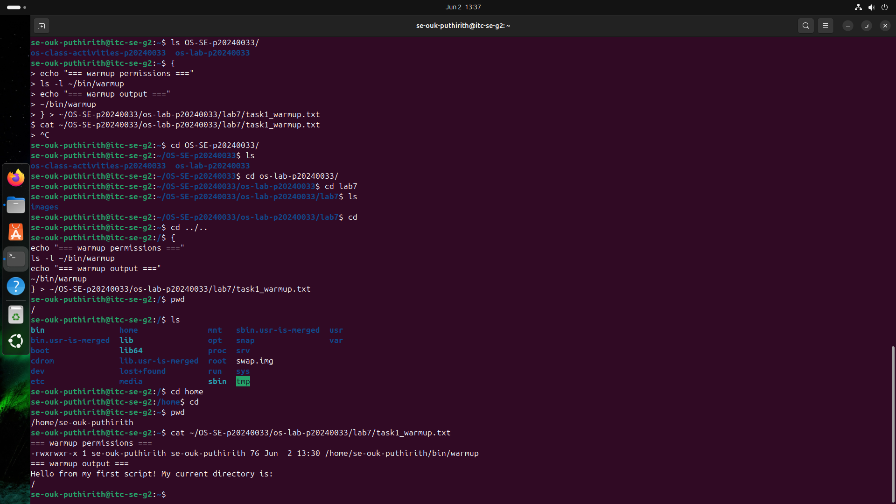
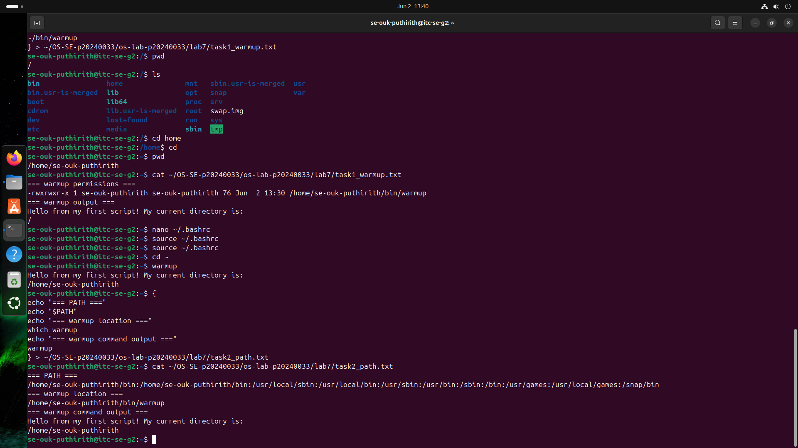
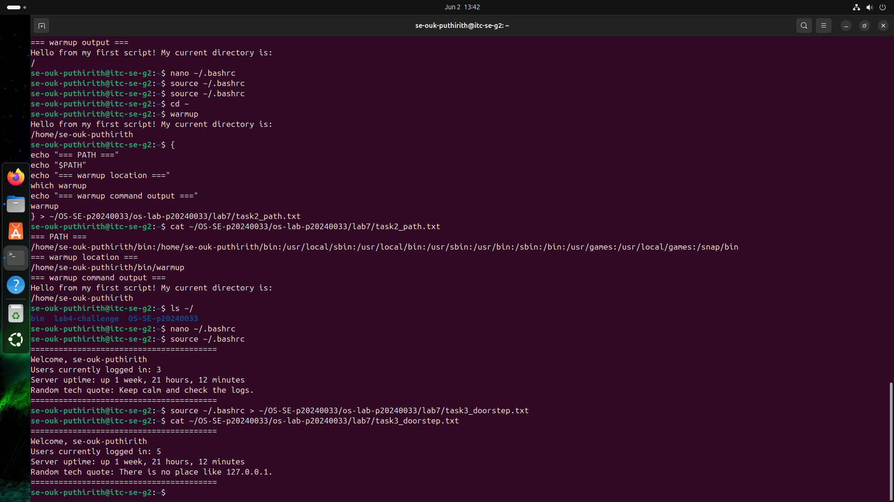
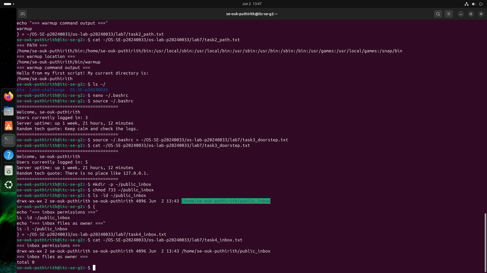
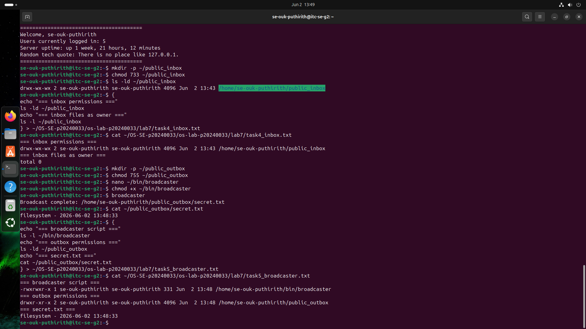
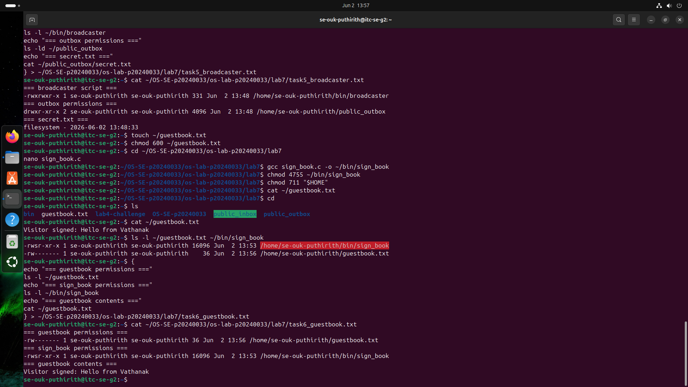
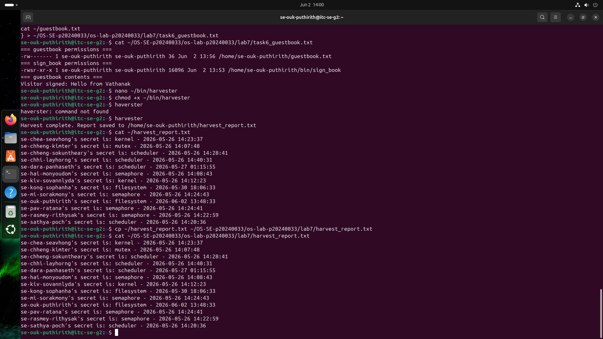
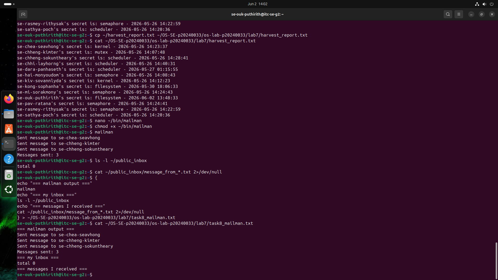

# OS Lab 7 Submission — Bash Scripting, Permissions & Server Automation

- **Student Name:** Ouk Puthirith
- **Student ID:** p2040033

---

## Task Output Files

Make sure all of the following files are present in your `lab7/` folder:

- [ ] `task1_warmup.txt`
- [ ] `task2_path.txt`
- [ ] `task3_doorstep.txt`
- [ ] `task4_inbox.txt`
- [ ] `task5_broadcaster.txt`
- [ ] `task6_guestbook.txt`
- [ ] `harvest_report.txt`
- [ ] `task8_mailman.txt`
- [ ] `sign_book.c`
- [ ] `scripts/warmup`
- [ ] `scripts/broadcaster`
- [ ] `scripts/harvester`
- [ ] `scripts/mailman`
- [ ] `scripts/sign_book_binary`

---

## Screenshots

Insert your screenshots below.

### Screenshot 1 — Task 1: Warm-Up Script
Show `cat task1_warmup.txt` with the executable `warmup` script and successful output.

---

### Screenshot 2 — Task 2: PATH Setup
Show `cat task2_path.txt` with your `PATH`, `which warmup`, and running `warmup` by name.

---

### Screenshot 3 — Task 3: Doorstep Message
Show `cat task3_doorstep.txt` with username, users online, uptime, and random quote.

---

### Screenshot 4 — Task 4: Secure Mailbox
Show `cat task4_inbox.txt` with `public_inbox` permissions and a test file from a classmate.

---

### Screenshot 5 — Task 5: Broadcaster
Show `cat task5_broadcaster.txt` with the broadcaster script evidence and `secret.txt`.

---

### Screenshot 6 — Task 6: VIP Guestbook
Show `cat task6_guestbook.txt` with guestbook permissions, SUID binary permissions, and guestbook contents.

---

### Screenshot 7 — Task 7: Data Harvester
Show `cat harvest_report.txt` containing secrets collected from classmates.

---

### Screenshot 8 — Task 8: Mailman Bot
Show `cat task8_mailman.txt` with mailman output and messages received in your inbox.

---

## Answers to Lab Questions

1. **Why did `warmup` fail before you added execute permission?**
   The warmup script failed because it did not have execute permission. Linux requires the execute (x) permission before a file can be run as a program. After using chmod +x warmup, the script became executable and ran successfully.

2. **What does adding `~/bin` to `PATH` allow you to do?**
   Adding ~/bin to the PATH allows the shell to search that directory for executable files. This lets me run my scripts by typing their names directly, such as warmup or broadcaster, without specifying the full path or using ./.

3. **Why does `chmod 733 public_inbox` allow classmates to drop files but not list the inbox?**
   The permission 733 gives the owner full permissions (rwx) while everyone else gets write and execute permissions (wx). This allows classmates to create files in the directory but prevents them from reading or listing its contents because they do not have read permission.

4. **Why does Linux ignore SUID on shell scripts, and why did we use a compiled C program instead?**
   Linux ignores SUID on shell scripts for security reasons because shell scripts are vulnerable to race conditions and privilege escalation attacks. A compiled C program can safely use the SUID bit, so we used a C program to demonstrate SUID behavior while allowing controlled access to the guestbook file.

5. **What is the difference between `>` and `>>` in Bash redirection?**
   The > operator writes output to a file and overwrites any existing contents. The >> operator appends output to the end of a file without removing the existing contents.

6. **How did your `harvester` avoid reading files that were missing or not readable?**
   The harvester script checked each target file using [ -f "$target_file" ] to ensure the file existed and [ -r "$target_file" ] to verify it was readable. The script only processed files that passed both checks.
7. **What permission problems did you or your classmates need to fix during the lab?**
   Common permission issues included scripts that were not executable, inbox directories that did not allow classmates to write files, outbox files that were not readable by other users, and home directories that blocked access to shared resources. These issues were resolved by applying the correct permissions using chmod.
---

## Reflection

This lab taught me how Bash scripting, file permissions, and automation work together on a shared Linux system. I learned how to create executable scripts, configure the PATH environment variable, manage secure directory permissions, and automate tasks using loops, variables, and file redirection. The lab also demonstrated the importance of proper permission settings when multiple users interact on the same server. Overall, it provided practical experience with Linux administration, scripting, and secure resource sharing.