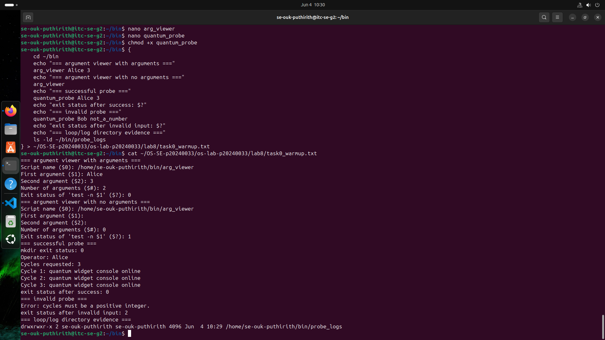
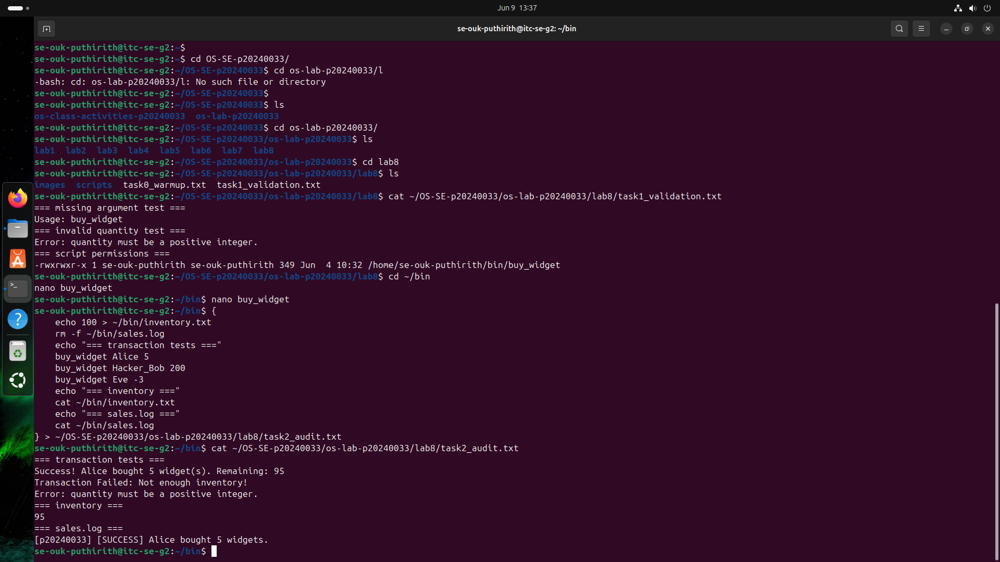
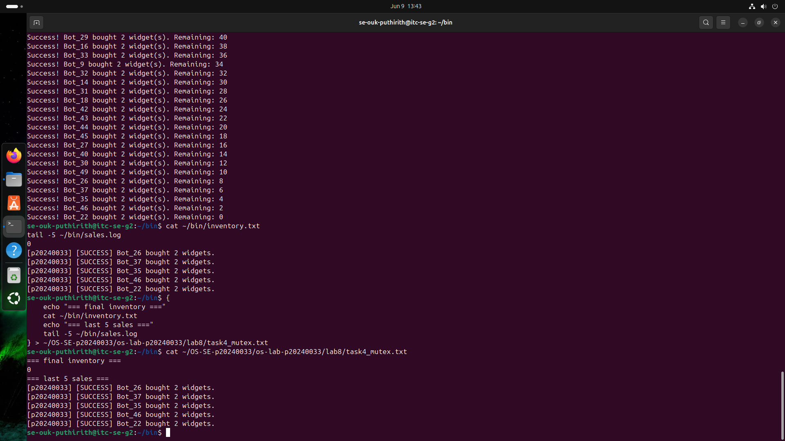
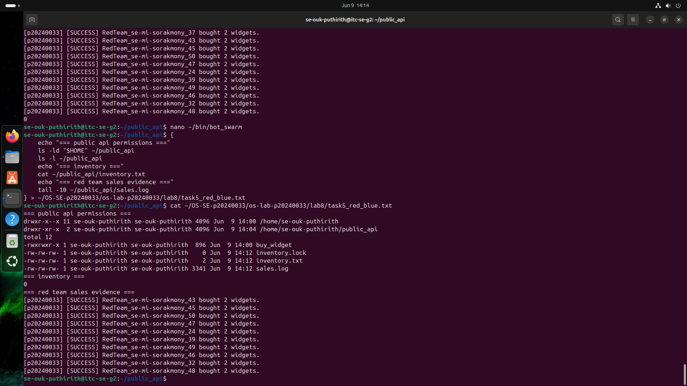
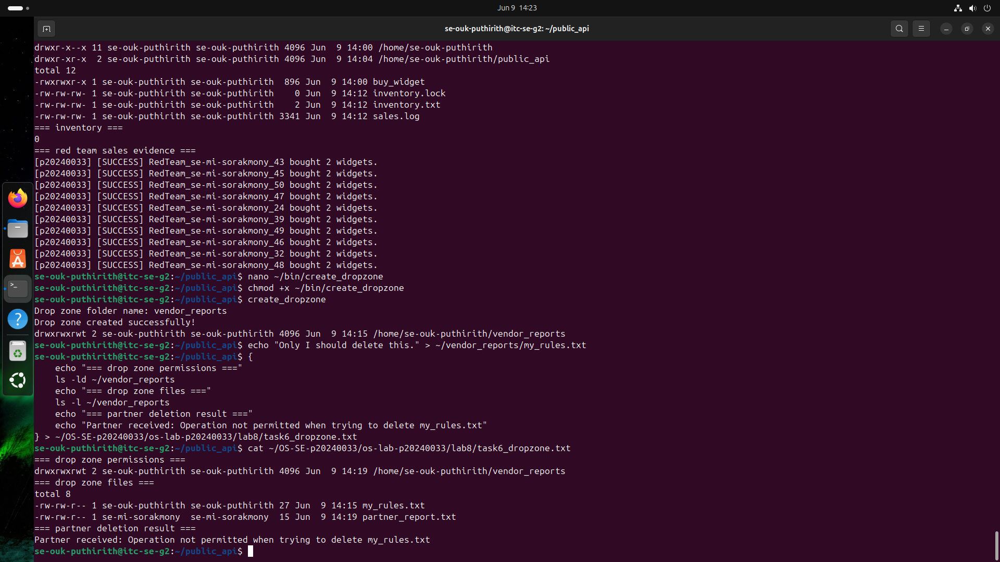
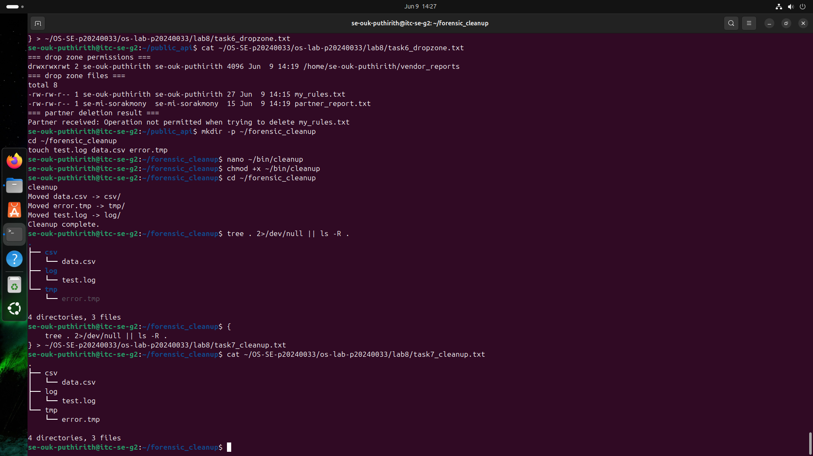

# OS Lab 8 Submission - The Quantum Widget Exploit
- **Student Name:** Ouk Puthirith
- **Student ID:** p20240033
- **Partner Username:** se-mi-sorakmony
---
## Task Output Files
- [x] `observations.txt`
- [x] `task0_warmup.txt`
- [x] `task1_validation.txt`
- [x] `task2_audit.txt`
- [x] `task4_mutex.txt`
- [x] `task5_red_blue.txt`
- [x] `task6_dropzone.txt`
- [x] `task7_cleanup.txt`
- [x] `scripts/arg_viewer`
- [x] `scripts/quantum_probe`
- [x] `scripts/buy_widget`
- [x] `scripts/bot_swarm`
- [x] `scripts/create_dropzone`
- [x] `scripts/cleanup`
---
## Screenshots

### Screenshot 1 - Level 0: Bash Warm-Up Scripts
Show `arg_viewer` explaining `$0`, `$1`, `$2`, `$#`, and `$?`, then show `quantum_probe` using a condition and a loop.

---

### Screenshot 2 - Level 2: Audit Trails
Show input validation, a successful sale, failed transactions, final inventory, and `sales.log`.

---

### Screenshot 3 - Level 4: Mutex Patch
Show `inventory.txt` exactly `0` after the patched `bot_swarm`, plus the last five lines of `sales.log`.

---

### Screenshot 4 - Level 5: Red Team vs. Blue Team
Show `public_api` permissions, inventory, and sales log evidence that your classmate executed your API.

---

### Screenshot 5 - Level 6: Secure Drop Zone
Show the sticky bit in `ls -ld` output and evidence that your partner could not delete your file.

---

### Screenshot 6 - Level 7: Forensic Cleanup
Show `tree` or `ls -R` output proving `.log`, `.csv`, and `.tmp` files were sorted into folders.

---

## Race Condition Observations
Summarize your five vulnerable `bot_swarm` runs from `observations.txt`:

| Run | Final Inventory | Notes |
|:---:|----------------:|-------|
| 1 | -2 | Went negative — two bots both passed the check at 0 and both subtracted |
| 2 | 96 | Only 2 bots successfully updated — 48 overwrote each other |
| 3 | 96 | Same pattern — most updates lost to race condition |
| 4 | 98 | Only 1 bot write survived — all others were overwritten |
| 5 | 96 | Consistent with runs 2 and 3 — scheduler behaviour repeated |

---

## Answers to Lab Questions

1. **In `arg_viewer`, what did `$0`, `$1`, `$2`, `$#`, and `$?` mean when you ran the script?**
   > `$0` is the name of the script itself (arg_viewer). `$1` is the first argument passed (Alice), and `$2` is the second argument (3). `$#` is the total number of arguments provided, which was 2. `$?` is the exit status of the most recently run command — in this case it was the result of `test -n $1`, which returned 0 because $1 was not empty.

2. **What does TOC-TOU mean, and where did it appear in the vulnerable `buy_widget` script?**
   > TOC-TOU stands for Time-of-Check to Time-of-Use. It is a race condition where the state of a resource changes between when it is checked and when it is used. In the vulnerable `buy_widget`, the script reads inventory (check), then calculates the new value, then writes it back (use). When 50 bots run concurrently, multiple processes read the same inventory value before any of them write back, so many updates overwrite each other and inventory is not reduced correctly. Run 1 even produced -2, proving two processes both passed the zero check simultaneously.

3. **Why did `bot_swarm` sometimes leave inventory values other than `0` before the patch?**
   > Because multiple bot processes ran concurrently without any locking. Several processes would read the same current inventory value at the same time, each calculate their own new value independently, and then each write back their result. The last process to write wins, overwriting all the others. This means many purchases are effectively lost and the inventory does not reach 0. In our runs, the inventory ended at values like 96, 98, and even -2 instead of the expected 0.

4. **What part of the script is the critical section, and why must it be protected?**
   > The critical section is the block that reads `inventory.txt`, checks if enough stock exists, calculates the new inventory, writes it back, and appends to `sales.log`. It must be protected because all these steps must happen as one atomic operation. If another process interrupts between the read and the write, both processes will act on stale data and corrupt the inventory count.

5. **How does `flock -x` enforce mutual exclusion between concurrent processes?**
   > `flock -x` acquires an exclusive lock on a file descriptor linked to a lock file. When one process holds the lock, all other processes trying to acquire the same lock are blocked and must wait. Only after the first process releases the lock by exiting the block can the next process enter. This ensures only one process executes the critical section at a time, making the inventory update atomic.

6. **Which permissions did you use to let a classmate run your API without giving full access to your home directory?**
   > `chmod o+x $HOME` allows others to traverse the home directory without reading its contents. `chmod 755 ~/public_api` makes the folder accessible. `chmod o+rx ~/public_api/buy_widget` lets others read and execute the script. `chmod o+rw` on `inventory.txt`, `sales.log`, and `inventory.lock` lets others read and write only those specific files without exposing anything else.

7. **Why does the sticky bit protect files in a shared drop zone?**
   > The sticky bit on a directory means that even if others have write permission to the directory, they can only delete or rename files that they own. So a partner can create their own files in the drop zone but cannot delete files owned by another user. This enforces the principle of least privilege in a shared environment.

8. **What defensive scripting practice from this lab would you use in a real production script?**
   > I would always use `flock` to protect any shared file that multiple processes might read and write concurrently. I would also use strict input validation with regex to reject unexpected values before they reach any logic, use absolute paths anchored to `$script_dir` so the script behaves correctly no matter where it is called from, and log every transaction with a user ID so there is always an audit trail for incident response.

---

## Reflection
> This lab showed me that even a simple Bash script can have serious security flaws when the OS runs multiple processes concurrently. Without locking, the OS scheduler can switch between processes at any point, which breaks assumptions about reading and writing shared files. The race condition was clearly visible in our results — inventory went as low as -2, which would be a critical bug in a real store. File permissions are not just about blocking access — they are a layered defense where each level grants only the minimum needed. The sticky bit, execute-only traversal, and flock together demonstrate how OS primitives work together to create a secure and correct concurrent system.
